<!-- PAPER TITLE -->

# Machine Learning Assignment 1

<!-- TABLE OF CONTENTS -->

<details>
  <summary>Table of Contents</summary>
  <ol>
    <li><a href="#authors">Authors</a></li>
    <li><a href="#enviroments">Enviroments</a></li>
    <li><a href="#introduction">Introduction</a></li>
    <li><a href="#datasets">Datasets</a></li>
    <li><a href="#embedding-method">Embedding method</a></li>
    <li><a href="#machine-learning-algorithm">Machine learning algorithm </a></li>
    <li><a href="#references">References</a></li>
  </ol>
</details>

## Authors

<ol>
    <li><a href="">Tieu Tri Bang       - 2252079</a></li>
    <li><a href="">Nguyen Van Hieu     - 2153345</a></li>
    <li><a href="">Pham Huy Thien Phuc - 2053346</a></li>
    <li><a href="">Le Minh Nhat        - 1952375</a></li>
</ol>

## Enviroments
All experiments run successfully on Google Colab with:

- Python version: 3.11.11
- PyTorch version: 2.5.1+cu124

All data, embedding and checkpoint in the drive: https://drive.google.com/drive/folders/1agMD9c4U9O-NfGh-uTjIHZ-S8w6jK7bK?usp=sharing or you can generate yourself using code in: https://colab.research.google.com/drive/1-lVAvfJVFnOZeESRz-Jiv8R7i_lHqgvU?usp=sharing

## Introduction
The classification of 3D medical images presents unique challenges and opportunities in the field of medical imaging and machine learning. In this study, we leverage the MedMNIST [[1]](#1) dataset, a standardized benchmark for medical imaging tasks, to develop and evaluate classifiers for 3D image data. We explore three distinct embedding approaches: a flatten-based method, a 2D Convolutional Neural Network (CNN), and a 3D CNN, each designed to capture spatial features at varying levels of complexity. Results demonstrate that the 3D CNN outperforms simpler embeddings in capturing intricate volumetric patterns, though trade-offs in computational cost are notable. This work provides insights into the suitability of these approaches for 3D medical image classification and establishes a foundation for future advancements in automated diagnostic systems.
## Datasets
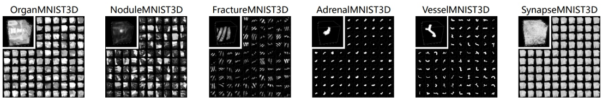

In this study, we utilize six 3D datasets from MedMNIST—OrganMNIST3D, NoduleMNIST3D, AdrenalMNIST3D, FractureMNIST3D, VesselMNIST3D, and SynapseMNIST3D—each preprocessed to a standardized 28x28x28 resolution, to investigate multi-class classification of anatomical and pathological features.


## Embedding 
### Method
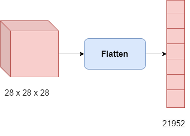

**Flatten**: In this method, each 3D volume is unraveled into a 1D vector of length 21,952 (28 × 28 × 28). While computationally simple and requiring minimal architectural complexity, this approach discards all spatial relationships inherent in the volumetric data, treating each voxel as an independent feature. As a result, it relies entirely on the subsequent dense layers to learn any patterns or dependencies, making it less suited for capturing the rich 3D structural information present in medical imaging tasks.

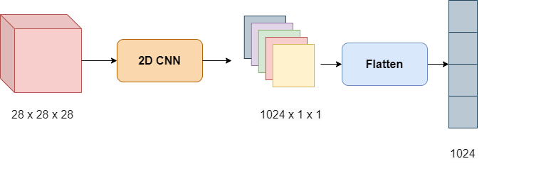

**2D-CNN**: The 2D-CNN embedding adapts a conventional 2D convolutional approach to handle the 3D 28x28x28 volumes by treating the depth dimension as a channel-like feature. Specifically, each 3D volume is processed as a stack of 28 two-dimensional 28x28 slices, where the depth (z-axis) is interpreted as 28 input channels. A 2D-CNN architecture, consisting of convolutional layers, pooling layers, and fully connected layers, is then applied to extract spatial features from each slice. This method leverages well-established 2D convolutional operations to capture patterns within individual planes of the volume, such as edges or textures, but it does not explicitly model correlations across the depth dimension. While more sophisticated than the flatten approach, the 2D-CNN may struggle to fully represent the volumetric relationships critical for 3D medical image classification, potentially limiting its performance on tasks requiring holistic 3D understanding.

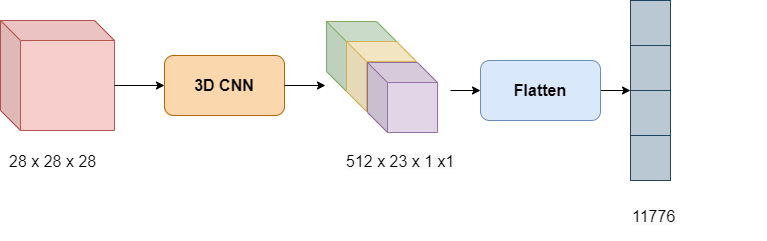

**3D-CNN**: The 3D-CNN embedding is designed to fully exploit the volumetric nature of the 28x28x28 MedMNIST datasets by applying 3D convolutional operations. In this approach, the input volume is processed directly as a 3D tensor, with convolutional kernels extending across all three dimensions (x, y, z). The architecture typically includes multiple 3D convolutional layers followed by pooling layers to reduce spatial dimensions, culminating in fully connected layers for classification. This method captures spatial dependencies and contextual information across the entire volume, making it particularly well-suited for identifying complex 3D structures, such as organ boundaries, nodule shapes, or vascular networks. However, the increased representational power comes at the cost of higher computational complexity and memory requirements compared to the flatten and 2D-CNN methods.

### Feature Analysis

Note: 'nodulemnist3d' is the class 0, 'vesselmnist3d' is the class 1, 'synapsemnist3d' is the class 2, 'adrenalmnist3d' is the class 3, 'fracturemnist3d' is the class 4, 'organmnist3d' is the class 5 in all the images in this section

#### Flatten:

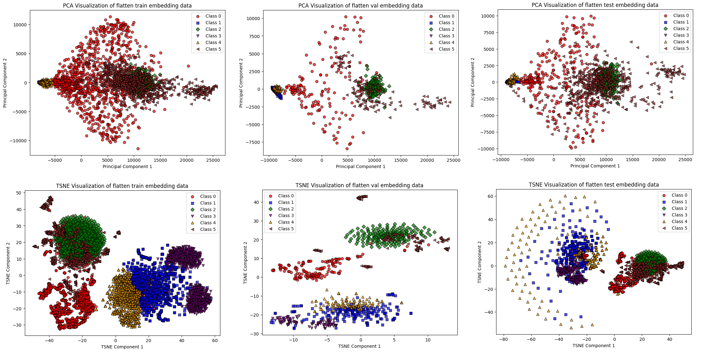
The PCA visualizations of the train, validation, and test sets show remarkably similar distributions, with clusters of points, particularly for Classes 0 and 2, appearing quite consistent across the three datasets. However, a significant drawback is the lack of separation between classes, as there is substantial overlapping, making it challenging to distinguish between them effectively. In contrast, the t-SNE visualizations reveal distinctly different distributions across the train, validation, and test sets, with the training data showing tighter, more separated clusters compared to the validation and test sets. This discrepancy suggests that while t-SNE better captures the local structure and separability within the training data, the model fitted on this distribution struggles to generalize to the validation and test sets, indicating potential issues with overfitting or insufficient representation of the data's variability across all stages.

#### 2D-CNN:
**Initialization weight:**

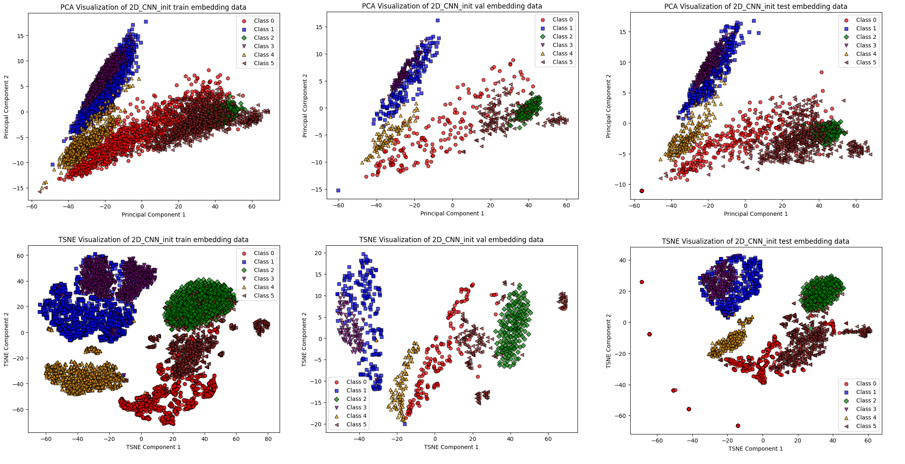

The PCA visualizations of the 2D CNN initialized weight embeddings (before training) for the train, validation, and test sets demonstrate a consistent distribution across all three datasets, suggesting that the initialization preserves a uniform structure before any training occurs. Compared to the flatten embeddings, these 2D CNN embeddings appear to offer an advantage, as they can capture the spatial relationships of 2D dimensions such as width and height, leading to potentially richer representations of the data. Furthermore, the distributions in these PCA plots show improved separation among classes compared to the flatten embeddings; for instance, Class 2 forms a distinct, tight cluster, indicating better class separability. This enhanced structure highlights the benefit of leveraging 2D CNN architectures, which may better preserve meaningful patterns in the data, even in the initial, untrained state.

**Pretrained weight:**

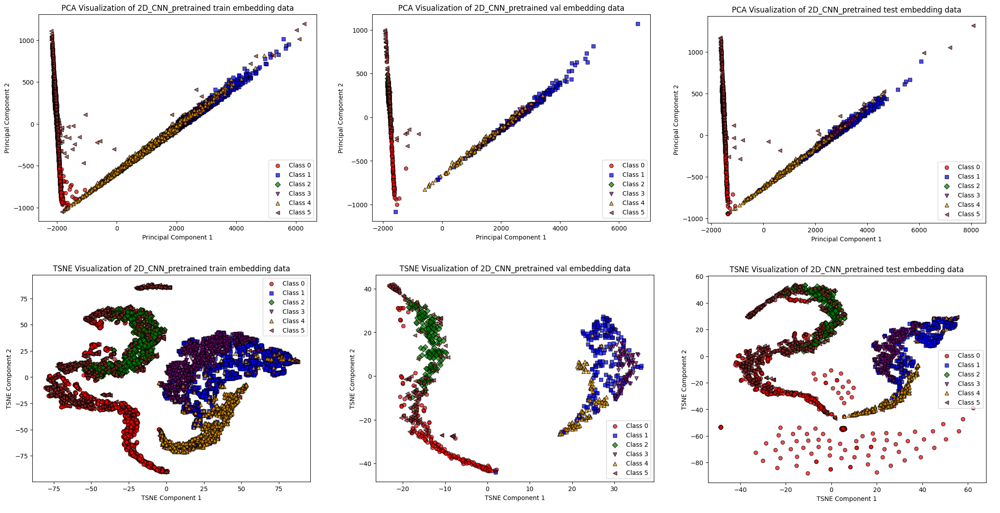
The PCA visualizations of the 2D CNN pretrained weight embeddings, which have been trained on the training data and validated on the validation data, exhibit a consistent distribution across the train, validation, and test sets, indicating that the pretrained model maintains a stable structure across all datasets. This consistency is an improvement over the flatten embeddings, as the 2D CNN architecture effectively captures the spatial relationships of 2D dimensions such as width and height, resulting in more robust representations of the data. Additionally, the distributions in these PCA plots show better separation among classes compared to the flatten embeddings, with the train, validation, and test sets displaying similar patterns and shapes, such as the distinct linear arrangement of points across classes. This similarity in patterns across datasets suggests that the pretrained 2D CNN model generalizes well, preserving meaningful class distinctions and spatial information effectively.

#### 3D-CNN:
**Initialization weight:**

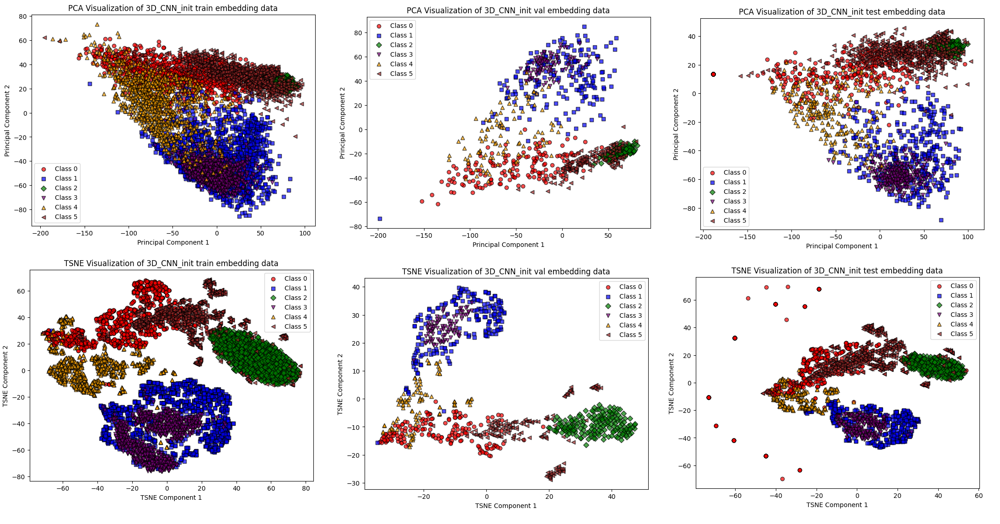
The PCA and t-SNE visualizations of the 3D CNN initialized weight embeddings (before training) reveal a relatively consistent distribution across the train, validation, and test sets, indicating that the initialization maintains a similar structure across all three datasets. However, despite this uniformity, there is a lack of clear separation among the classes, as evidenced by significant overlap, particularly between Class 1 and Class 3, where points from these classes intermingle in both the PCA and t-SNE plots. This overlapping suggests that the initial embeddings, while structurally similar across datasets, do not yet capture distinct features necessary for effective class discrimination. The similarity in distribution highlights the stability of the 3D CNN’s initialization, but the lack of separation indicates that further training or feature engineering may be required to enhance class distinguishability.

**Pretrained weight:**

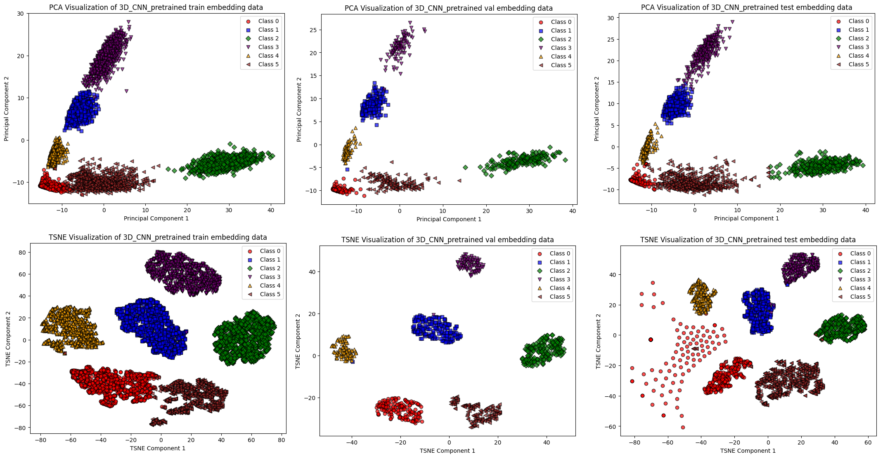
The PCA and t-SNE visualizations of the 3D CNN pretrained weight embeddings, which have been trained on the training data and validated on the validation data, consistently demonstrate clear clustering and a similar distribution across the train, validation, and test sets. This uniformity highlights the model’s ability to effectively capture and preserve the spatial information of the three-dimensional data, leveraging the 3D CNN’s capacity to understand the depth, width, and height dimensions. In both PCA and t-SNE plots, classes form distinct clusters—such as the tight grouping of blue (Class 1) and green (Class 2) points—indicating improved separability compared to earlier stages or other architectures. The consistent patterns across datasets underscore the pretrained 3D CNN’s robustness in generalizing spatial relationships, making it well-suited for handling complex 3D data structures.

### Computational Efficiency Analysis
This document provides a computational comparison between Flattening, 2D Convolutional Neural Networks (2D CNN), and 3D Convolutional Neural Networks (3D CNN) in terms of parameter count, memory consumption, and computational complexity.

#### 1. Flatten
Flattening transforms a multi-dimensional input (e.g., images or volumes) into a 1D vector.

**Advantages:**
- Simple and computationally efficient.
- Requires fewer parameters than CNNs.
- Suitable for simple tasks with small datasets.

**Disadvantages:**
- Ignores spatial information (no local feature extraction).
- Performs poorly on complex structured data.

**Computational Complexity:**
- $$O(n)$$ (linear transformation)

####  2. 2D CNN (Convolutional Neural Network)
2D CNNs process 2D images using convolutional layers with kernels (filters) that slide spatially across width and height.

**Advantages:**
- Captures spatial hierarchies in data.
- Reduces parameter count compared to fully connected networks.
- Efficient for image-based tasks.

**Disadvantages:**
- Limited to processing 2D information; loses depth-wise relationships.
- Not suitable for volumetric data (e.g., medical imaging, video frames).


**Computational Complexity:**
For a single convolution layer with input size $$(H , W , C_{in})$$, kernel size $$(K , K , C_{in} , C_{out})$$, and output size $$(H' , W' , C_{out})$$:
- $$O(H'x W'x K^2 x C_{in} x C_{out})$$
- Memory usage is proportional to feature maps.


####  3. 3D CNN (3D Convolutional Neural Network)
3D CNNs extend 2D convolutions by adding a depth dimension, making them suitable for volumetric data (e.g., video, medical scans).

**Advantages:**
- Captures spatial and temporal/depth-based features.
- Suitable for volumetric data like MRI scans, CT scans, and video analysis.

**Disadvantages:**
- Significantly higher computational cost.
- Requires more memory than 2D CNNs.
- Needs large datasets to generalize well.

**Computational Complexity:**
For an input of size $$(D, H, W, C_{in})$$ and a kernel of size $$(K , K , K, C_{in}, C_{out})$$, the output size is $$(D', H', W', C_{out})$$, and the complexity is:
- $$O(D' x H' x W' x K^3 x C_{in} x C_{out})$$
- Memory requirements are significantly higher than 2D CNNs due to additional depth dimension.

### Performance Analysis
After passing through 2D CNN or 3D CNN, the embedding is fed into an MLP (Multi-Layer Perceptron) to fine-tune the figure, ensuring that it fits well with the training set of the dataset. The MLP acts as a feature adjuster, refining the extracted representations to improve model performance on the given data.

Here are the performance figures over epochs for 2D and 3D CNN when running on the MedMNIST dataset.
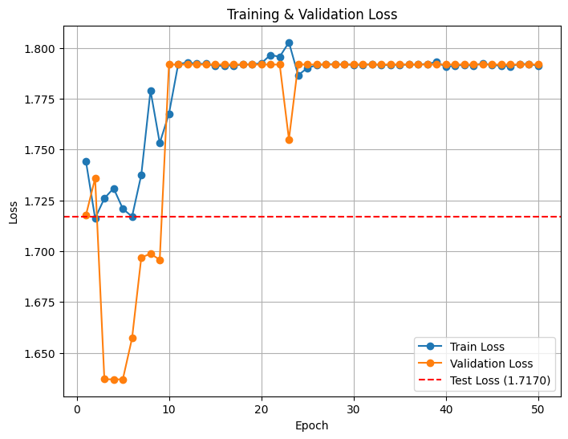

The training and validation loss increase instead of decreasing, indicating that the model struggles to learn meaningful features. After the first few epochs, the loss fluctuates and stabilizes at a high value (~1.8), suggesting that the model is not converging well. The test loss (1.7170) is high, implying poor generalization. This suggests that the 2D CNN may not be capturing the necessary spatial information effectively.


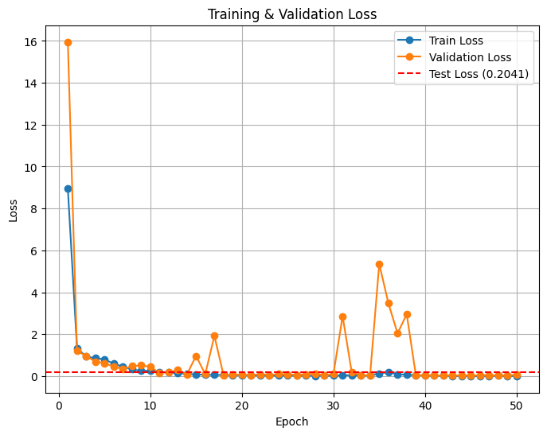

The training and validation loss decrease rapidly in the first few epochs, indicating effective learning. The loss stabilizes at a low value (~0.2041), suggesting that the model has converged well. Some fluctuations in validation loss are observed, but overall, it remains relatively low. The low test loss (0.2041) suggests good generalization, making this model more suitable for the dataset.

**Conclusion:**
- The 3D CNN significantly outperforms the 2D CNN in this case, achieving much lower loss values.
- The 2D CNN struggles to learn useful features, leading to poor convergence.
- Since MedMNIST contains medical imaging data, 3D CNNs may be better suited for capturing spatial relationships in volumetric data.


## Machine Learning Algorithm 
### Decision tree
**Performance:** With each model, the depth coefficients in the range from 5 to 30 with steps of 5 will be substituted for the performance analysis. As the result, the graph showing the correlation between the depth coefficient and performance will be plotted with the accuracy at each step.

Flatten: 
 
| Max Depth | Accuracy | Precision | Recall | F1 Score |
|-----------|----------|-----------|--------|----------|
| 5         | 0.783651 | 0.808604  | 0.783651 | 0.782979 |
| 10        | 0.847283 | 0.854890  | 0.847283 | 0.846956 |
| 15        | 0.852178 | 0.857412  | 0.852178 | 0.851908 |
| 20        | 0.862947 | 0.865628  | 0.862947 | 0.862577 |
| 25        | 0.869799 | 0.871304  | 0.869799 | 0.869791 |

2D_CNN_init:

| Max Depth | Accuracy | Precision | Recall | F1 Score |
|-----------|----------|-----------|--------|----------|
| 5         | 0.883505 | 0.883267  | 0.883505 | 0.883099 |
| 10        | 0.900636 | 0.900718  | 0.900636 | 0.900612 |
| 15        | 0.903573 | 0.903768  | 0.903573 | 0.903510 |
| 20        | 0.895742 | 0.895717  | 0.895742 | 0.895608 |
| 25        | 0.894763 | 0.894838  | 0.894763 | 0.894700 |

2D_CNN_pretrained:
 
| Max Depth | Accuracy | Precision | Recall | F1 Score |
|-----------|----------|-----------|--------|----------|
| 5         | 0.861968 | 0.861571  | 0.861968 | 0.860995 |
| 10        | 0.891826 | 0.891916  | 0.891826 | 0.891008 |
| 15        | 0.877141 | 0.876791  | 0.877141 | 0.875809 |
| 20        | 0.879589 | 0.879295  | 0.879589 | 0.878279 |
| 25        | 0.881547 | 0.880992  | 0.881547 | 0.880747 |

3D_CNN_init:
 
| Max Depth | Accuracy | Precision | Recall | F1 Score |
|-----------|----------|-----------|--------|----------|
| 5         | 0.906510 | 0.907809  | 0.906510 | 0.906656 |
| 10        | 0.929515 | 0.929580  | 0.929515 | 0.929477 |
| 15        | 0.926089 | 0.926046  | 0.926089 | 0.925962 |
| 20        | 0.924131 | 0.924283  | 0.924131 | 0.924021 |
| 25        | 0.918747 | 0.918625  | 0.918747 | 0.918564 |

 3D_CNN_pretrained:
 
| Max Depth | Accuracy | Precision | Recall | F1 Score |
|-----------|----------|-----------|--------|----------|
| 5         | 0.995595 | 0.995602  | 0.995595 | 0.995595 |
| 10        | 0.994126 | 0.994189  | 0.994126 | 0.994132 |
| 15        | 0.994126 | 0.994189  | 0.994126 | 0.994132 |
| 20        | 0.994126 | 0.994189  | 0.994126 | 0.994132 |
| 25        | 0.994126 | 0.994189  | 0.994126 | 0.994132 |

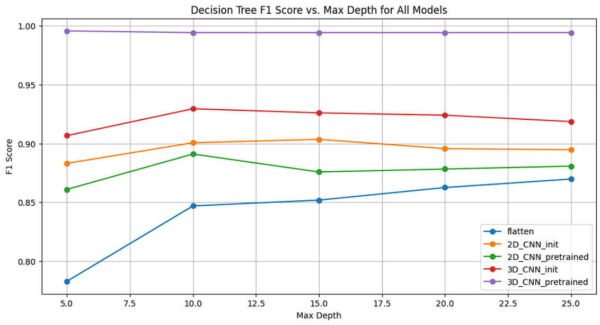


**Analysis:** 

Performance: The 3D_CNN_pretrained model performs the best, staying close to 1 at all depths, meaning it makes almost perfect predictions. The 3D_CNN_init model also does well but drops slightly at deeper depths. The 2D_CNN_init and 2D_CNN_pretrained models have good F1 scores, but the pretrained version peaks early and then declines a bit, possibly due to overfitting. The flatten model starts with the lowest F1 score but improves with depth, showing that deeper trees help compensate for simpler embeddings. Most models perform best at depths 10-15, with deeper trees not always leading to better results. In general, pretrained models outperform models trained from scratch, and 3D CNN models work better than 2D CNN models, proving that richer feature extraction leads to better classification.

Storage: As the depth increases, storage requirements grow significantly. A deeper tree has more nodes, which increases memory usage for storing the tree structure and learned parameters. This means that deeper trees require substantially more memory, making them less efficient for large datasets, which tends to store more details about training data, increasing the risk of overfitting.

Speed: As the depth increases, speed decreases in both training and inference. Training takes longer because deeper trees require more splits and calculations. Inference also slows down since each prediction must traverse more levels from the root to a leaf node, increasing the number of comparisons. This added computational cost can make deep trees impractical for large datasets or real-time applications.

### Random forest
**Performance:** Random Forest is an ensemble learning algorithm that constructs multiple decision trees and aggregates their results to improve prediction accuracy and control overfitting. With each model, the depth coefficients in the range from 1 to 5 with steps of 1 will be substituted for the performance analysis. As a result, a graph illustrating the correlation between the depth coefficient and model performance will be plotted using accuracy at each step. This analysis aims to assess how the variation in maximum tree depth influences the overall classification accuracy of the Random Forest model in this study.

Flatten: 

| Max Depth | Accuracy | Precision | Recall | F1 Score |
|-----------|----------|-----------|--------|----------|
| 1         | 0.3505   | 0.1238    | 0.3505 | 0.1827   |
| 2         | 0.7230   | 0.6521    | 0.7230 | 0.6673   |
| 3         | 0.8199   | 0.8761    | 0.8199 | 0.8136   |
| 4         | 0.8483   | 0.8923    | 0.8483 | 0.8464   |

2D_CNN_Init:

| Max Depth | Accuracy | Precision | Recall | F1 Score |
|-----------|----------|-----------|--------|----------|
| 1         | 0.3607   | 0.2969    | 0.3607 | 0.2037   |
| 2         | 0.6740   | 0.6172    | 0.6740 | 0.6084   |
| 3         | 0.9075   | 0.9094    | 0.9075 | 0.9068   |
| 4         | 0.9290   | 0.9296    | 0.9290 | 0.9287   |

2D_CNN_Pretrained:

| Max Depth | Accuracy | Precision | Recall | F1 Score |
|-----------|----------|-----------|--------|----------|
| 1         | 0.3696   | 0.1373    | 0.3696 | 0.2001   |
| 2         | 0.6402   | 0.7035    | 0.6402 | 0.5738   |
| 3         | 0.7621   | 0.7822    | 0.7621 | 0.7537   |
| 4         | 0.8287   | 0.8400    | 0.8287 | 0.8264   |

3D_CNN_Init:

| Max Depth | Accuracy | Precision | Recall | F1 Score |
|-----------|----------|-----------|--------|----------|
| 1         | 0.5286   | 0.2944    | 0.5286 | 0.3739   |
| 2         | 0.6339   | 0.6691    | 0.6339 | 0.5500   |
| 3         | 0.8507   | 0.8636    | 0.8507 | 0.8464   |
| 4         | 0.9227   | 0.9231    | 0.9227 | 0.9226   |

3D_CNN_Pretrained:

| Max Depth | Accuracy | Precision | Recall | F1 Score |
|-----------|----------|-----------|--------|----------|
| 1         | 0.5301   | 0.3283    | 0.5301 | 0.3901   |
| 2         | 0.9780   | 0.9790    | 0.9780 | 0.9779   |
| 3         | 0.9902   | 0.9902    | 0.9902 | 0.9902   |
| 4         | 0.9931   | 0.9932    | 0.9931 | 0.9931   |

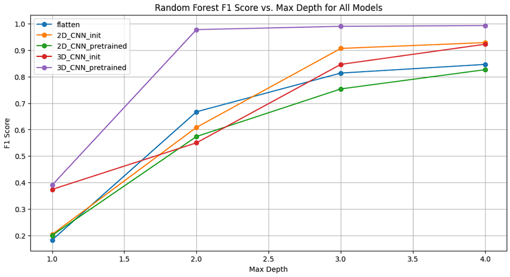

**Analysis:** 

Performance: The 3D_CNN_pretrained model clearly stands out, delivering near-perfect F1 scores at all tested depths (reaching 0.9931 at depth 4), indicating highly accurate and consistent predictions. This highlights the effectiveness of pretrained 3D features in capturing rich and relevant information for classification tasks. The 3D_CNN_init model also performs very well, gradually improving with depth and achieving a strong F1 score of 0.9226 at depth 4, though slightly below the pretrained counterpart. 

In contrast, the 2D_CNN_init model shows solid improvement as tree depth increases, ending at 0.9287 F1 score. Interestingly, the 2D_CNN_pretrained model underperforms compared to its non-pretrained version, peaking early and plateauing at a lower F1 score of 0.8264, possibly due to overfitting or poor feature transferability. This suggests that the pretrained 2D features may not be as well-aligned with the task domain as expected. The flatten model starts with the weakest performance, with an F1 score of 0.1827 at depth 1. However, it improves steadily and reaches 0.8464 at depth 4, demonstrating that even basic features can benefit significantly from deeper trees, which effectively extract complex decision boundaries from simpler inputs.

Overall, 3D models outperform 2D models, and pretraining is beneficial—especially for 3D CNNs. The performance gains across increasing depths also highlight that Random Forests can effectively exploit the richer feature spaces provided by deep learning embeddings.

Speed: Training and inference speed decrease with increasing depth. Training deep Random Forests requires more computational effort to evaluate splits, and during inference, each sample must traverse more nodes to reach a decision. This latency can be particularly problematic when real-time processing is needed. For instance, using deep trees with high-dimensional 3D CNN features may yield excellent accuracy but at the cost of slower predictions, making them less suitable for real-time tasks unless optimized or pruned.

### Multi-layer Perceptron (MLP)
In this experiment, we will use an MLP classifier to classify the features from the embeddings mentioned above. From left to right and top to bottom: flatten, 2D init, 2D pretrained, 3D init, and 3D pretrained, respectively.

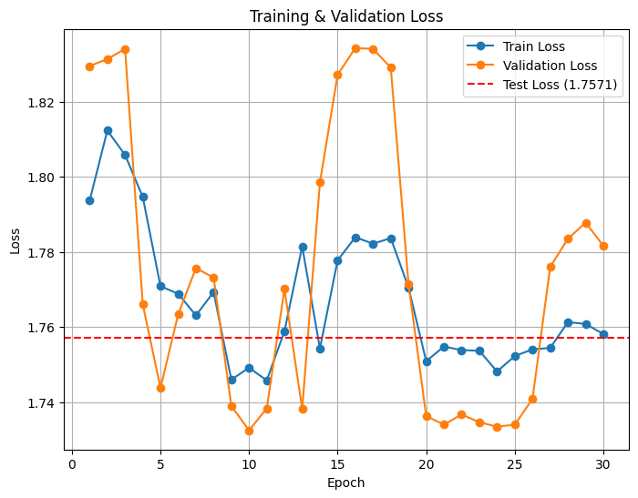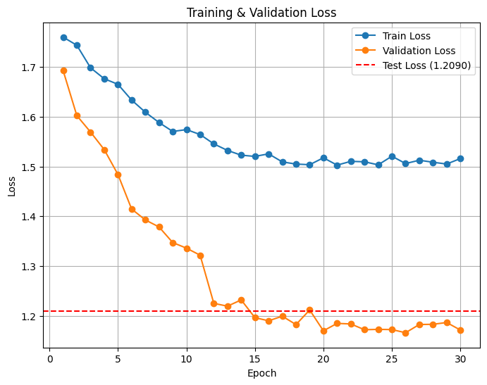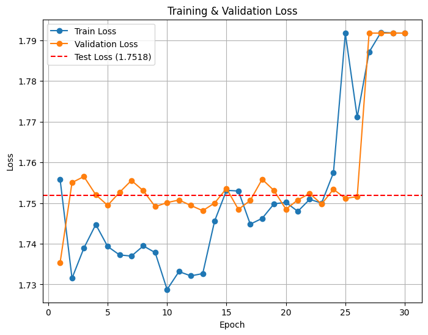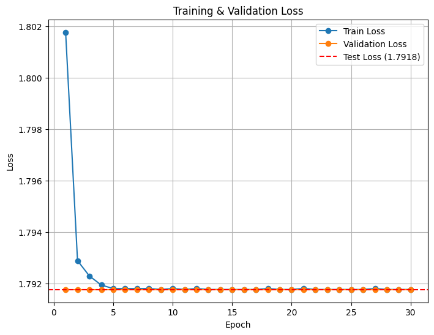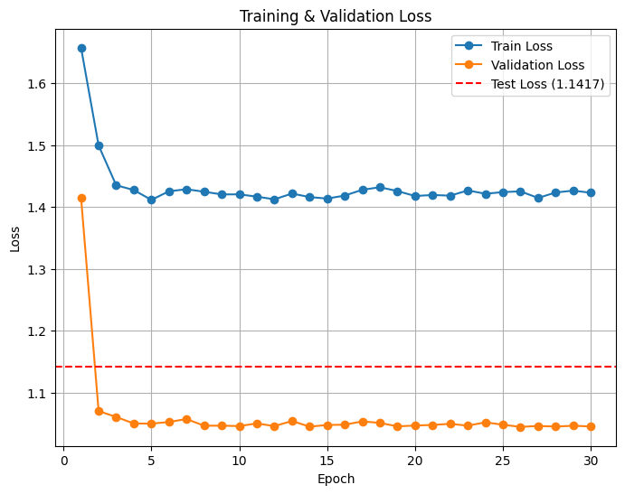

<table>
  <tr>
    <th>Embedding</th>
    <th>Accuracy</th>
    <th>Precision</th>
    <th>Recall</th>
    <th>F1 Score</th>
  </tr>
  <tr>
    <td>Flatten</td>
    <td>0.2637</td>
    <td>0.1393</td>
    <td>0.2637</td>
    <td>0.1598</td>
  </tr>
  <tr>
    <td>2D_CNN_init</td>
    <td>0.8476</td>
    <td>0.7924</td>
    <td>0.8476</td>
    <td>0.8099</td>
  </tr>
  <tr>
    <td>2D_CNN_pretrained</td>
    <td>0.2699</td>
    <td>0.0730</td>
    <td>0.2699</td>
    <td>0.1149</td>
  </tr>
  <tr>
    <td>3D_CNN_init</td>
    <td>0.2184</td>
    <td>0.0477</td>
    <td>0.2184</td>
    <td>0.0783</td>
  </tr>
  <tr>
    <td>3D_CNN_pretrained</td>
    <td>0.9007</td>
    <td>0.9431</td>
    <td>0.9007</td>
    <td>0.9036</td>
  </tr>
</table>

+ Overall Observations: 3D Pretrained MLP achieves the best test loss and stability, making it the most promising model. 2D Init MLP has reasonable performance but is outperformed by the 3D pretrained version. 2D Pretrained MLP and Flatten MLP suffer from instability, indicating potential issues with initialization or architecture. 3D Init MLP converges fast but does not generalize well.
  
+ Storage: Flatten MLP (21,952 x 1024 + 1024 parameters in the first layer) → Largest storage requirement, 3D CNN MLP (11,776 x 1024 + 1024 parameters in the first layer) → Moderate storage, 2D CNN MLP (1,024 x 1024 + 1024 parameters in the first layer ) → Smallest storage

+ Since all models have the same number of MLP layers, their speed remains identical.
### Naive Bayes

<table>
  <tr>
    <th>Embedding</th>
    <th>Accuracy</th>
    <th>Precision</th>
    <th>Recall</th>
    <th>F1 Score</th>
  </tr>
  <tr>
    <td>Flatten</td>
    <td>0.7714</td>
    <td>0.7823</td>
    <td>0.7714</td>
    <td>0.7621</td>
  </tr>
  <tr>
    <td>2D_CNN_init</td>
    <td>0.8194</td>
    <td>0.8284</td>
    <td>0.8194</td>
    <td>0.8146</td>
  </tr>
  <tr>
    <td>2D_CNN_pretrained</td>
    <td>0.7186</td>
    <td>0.7311</td>
    <td>0.7186</td>
    <td>0.6826</td>
  </tr>
  <tr>
    <td>3D_CNN_init</td>
    <td>0.8507</td>
    <td>0.8573</td>
    <td>0.8507</td>
    <td>0.8492</td>
  </tr>
  <tr>
    <td>3D_CNN_pretrained</td>
    <td>0.9692</td>
    <td>0.9723</td>
    <td>0.9692</td>
    <td>0.9692</td>
  </tr>
</table>

In this section, we discuss about the Naive Bayes algorithm and specifically its Gaussian variant. we utilize the Scikit-learn library with default parameters to fit and make predictions on the embeddings. The table above shows that the 3D embeddings, regardless of whether its before or after pretraining, performs significantly better than the other embedding methods. This is expected as the original data were 3-dimensional. However, an interesting observation shows that 2D_CNN_pretrained has the worst performance, likely due to a dimensional mismatch.

The Gaussian Naive Bayes formula:

$$P(x_{i}\mid y)=\frac{1}{\sqrt{2\pi \sigma_y^{2}}} \exp \left(-\frac{(x_{i} -\mu_{y})^2}{2\sigma_y^{2}} \right)$$

In terms of sparse feature handling, Gaussian Naïve Bayes (GNB) is not ideal for handling sparse features because it assumes a Gaussian distribution, which may not be well-suited for high-dimensional, sparse data.Flattened embeddings likely resulted in a less structured representation, leading to an accuracy of 77.14%. 3D CNN-based embeddings performed significantly better, likely because 3D convolutional networks excel at capturing volumetric information, being able to extract denser, more meaningful features before classification.

Scikit-learn’s GaussianNB includes a var_smoothing parameter (default: 1e-9) to stabilize variance estimates when features have very small variances. For low-variance features, GaussianNB may overfit, leading to unstable predictions. Model trained 2D_CNN_pretrained embeddings (71.86% accuracy) might have suffered due to a mismatch between pretrained features and the dataset, leading to variance underestimation. Smoothing helps prevent division by very small variances, which might explain why performance did not drop further.

Conditional Independence between features given the class is naturally presumed by Gaussian Naive Bayes algorith; however, CNN-extracted embeddings are typically highly correlated due to the way it is computed. Flattened embeddings likely had higher independence, making them better suited for GNB than some CNN-pretrained features. 3D CNN-pretrained embeddings (96.92%) had the best performance, suggesting that the extracted features, while correlated, were still structured in a way that aligned well with GNB’s assumptions. 2D_CNN_pretrained performed worse (71.86%), possibly because the extracted features had strong dependencies that GNB could not model effectively.

**Result analysis:** Naïve Bayes works best when features are independent, but CNN-extracted features are often correlated. Despite that, 3D CNN-based models performed the best, possibly because the feature dependencies were still manageable for GNB.


### Graphical Models (Bayesian Networks, HMM)
Graphical models, including Bayesian Networks and Hidden Markov Models (HMMs), are powerful tools when dealing with data that exhibits complex dependencies and uncertainties. However, they are generally infeasible when dealing with high dimensional data, such as for the 3D medical image classification task, even after the data has been flattened or transformed using 2D and 3D CNNs. Consequently, we decided to apply TSNE onto the embeddings to map them into a lower dimensional, so that applying Graphical Models for classification would be more practical. Despite that the models would most likely not perform well due to the conflicting natures of the models as well as the data, we show our findings and observations below:

## Bayesian Networks
Bayesian Networks are graphical models that represent the probabilistic relationships among a set of variables. They leverage graph theory and probability theory, particularly Bayes' theorem, to model uncertainty. A Bayesian network's structure is a Directed Acyclic Graph (DAG) and nodes in the graph represent variables, whereas directed edges (arrows) represent dependencies between those variables. Each node has an associated conditional probability distribution (CPD). This distribution quantifies the probability of a node's value given the values of its "parent" nodes (nodes with edges pointing to it), and the values are updated under the principle of the Bayes' Theorem, hence the name of the algorithm.
For our task, we utilize the Bayesian Networks implementation from pgmpy, which is usually very powerful when applied for certain applications; despite that, it faces significant challenges when applied to MedMNIST 3D data due to the large number of voxels (3D pixels). The number of possible network structures and conditional probability distributions grows exponentially with the number of variables present within the feature space, rendering Bayesian Networks to be  infeasible for doing classification for our task.

Our initial embeddings were originally of very high dimensional space, so we decided to map them to a lower dimensional space using the TSNE dimensional reduction technique. Despite our attempts, the training process still remained unsuccessful, and just doingtraining and inference on the flattened embeddings alone resulted in a timeout error on Google Colab. However, since there were multiple evidence suggesting that Bayesian Networks was unlikely to be effective on our data, judging from the algorithm's inherent nature, we decided to move on to focusing on other machine learning algorithms instead.


## Hidden Markov Machine
Hidden Markov Models (HMMs) are probabilistic sequence models used to analyze and predict sequential data. They're particularly effective when dealing with data where the underlying process is assumed to have hidden, unobserved states. For our task, we take advantage of the GaussianHMM from hmmlearn libary, which is a specific type of HMM that assumes the observed data follows a Gaussian distribution. Typically, how the GaussianHMM would work is that we first have to define the number of hidden states (which is the number of classes) in our task. Then, the GaussianHMM assumes that the observations emitted from each hidden state follow a Gaussian distribution. Therefore, each hidden state is associated with a mean vector and a covariance matrix. 
Hidden Markov Models (HMMs), while fundamentally designed for sequential data, can be adapted to handling classfication tasks, though they might not yield great results due to the inherent nature. The basic principle is to train an HMM for each class in the classification problem. Then, when a new, unknown sequence appears, we calculate the likelihood of that sequence belonging to each of the trained HMMs. The class corresponding to the HMM with the highest likelihood is then assigned as the predicted class. Below are results of applying the GaussianHMM model on the embeddings.

<table>
  <tr>
    <th>Embedding</th>
    <th>Accuracy</th>
    <th>Precision</th>
    <th>Recall</th>
    <th>F1 Score</th>
  </tr>
  <tr>
    <td>Flatten</td>
    <td>0.5193</td>
    <td>0.6020</td>
    <td>0.5193</td>
    <td>0.5169</td>
  </tr>
  <tr>
    <td>2D_CNN_init</td>
    <td>0.6701</td>
    <td>0.7935</td>
    <td>0.6701</td>
    <td>0.6535</td>
  </tr>
  <tr>
    <td>2D_CNN_pretrained</td>
    <td>0.4968</td>
    <td>0.6635</td>
    <td>0.4968</td>
    <td>0.4617</td>
  </tr>
  <tr>
    <td>3D_CNN_init</td>
    <td>0.6520</td>
    <td>0.7020</td>
    <td>0.6520</td>
    <td>0.6446</td>
  </tr>
  <tr>
    <td>3D_CNN_pretrained</td>
    <td>0.6696</td>
    <td>0.8521</td>
    <td>0.6696</td>
    <td>0.6737</td>
  </tr>
</table>

As expected, the results obtained from the Hidden Markov Machine are unsatisfactory. The model trained on 3D_pretrained embeddings had the best performance out of all the embeddings, though it still falls short compared to machine learning algorithms like Decision Trees or Naive Bayes. Models trained on other embeddings performed rather averagely, with the 2D_CNN_pretrained variant having done extremely poorly with the majority of the metrics being less than 0.5. As I mentioned, these results are more or less expected as HMMs are fundamentally designed for sequential data, and 3D medical images from MedMNIST are inherently volumetric, not sequential, so this results in a conflicting nature between the purpose of the model and the data.


### Support Vector Machine (Classifier)
In the realm of machine learning, Support Vector Machines (SVMs) stand out as robust and versatile algorithms, particularly effective for classification tasks. Imagine there exist data points belonging to two distinct categories, like "potential clients" and "non-clients." SVMs excel at drawing the optimal boundary, or "hyperplane," that best separates these categories.  Instead of just drawing any line that separates the data, SVMs aim to maximize the "margin" – the distance between the hyperplane and the closest data points from each class. These closest points are called "support vectors". However, in most cases, data isn't easily separable by a straight line, this leads to SVMs employing a clever trick called the "kernel trick", which transforms the data into a higher-dimensional space where a linear hyperplane can effectively separate the classes.

When working with the classification task for 3D medical imaging data, CNNs (both 2D and 3D) are instrumental in extracting meaningful features. These features, often represented as high-dimensional vectors, capture complex spatial and temporal patterns within the image. SVCs are inherently designed to handle high-dimensional data efficiently, thanks to the kernel trick, since the relationships between extracted features and medical conditions are often non-linear. SVCs, through kernels like the Radial Basis Function (RBF), can map these features into a higher-dimensional space where linear separation becomes possible. However, there is typically a lot of overhead cost when dealing with high dimensional data, so we also apply the TSNE dimensional reduction method onto the embeddings to save computational cost. The results are shown as below.

<table>
  <tr>
    <th>Embedding</th>
    <th>Accuracy</th>
    <th>Precision</th>
    <th>Recall</th>
    <th>F1 Score</th>
  </tr>
  <tr>
    <td>Flatten</td>
    <td>0.8267</td>
    <td>0.9060</td>
    <td>0.8267</td>
    <td>0.8421</td>
  </tr>
  <tr>
    <td>2D_CNN_init</td>
    <td>0.9804</td>
    <td>0.9805</td>
    <td>0.9804</td>
    <td>0.9804</td>
  </tr>
  <tr>
    <td>2D_CNN_pretrained</td>
    <td>0.8771</td>
    <td>0.8775</td>
    <td>0.8771</td>
    <td>0.8758</td>
  </tr>
  <tr>
    <td>3D_CNN_init</td>
    <td>0.9736</td>
    <td>0.9736</td>
    <td>0.9736</td>
    <td>0.9735</td>
  </tr>
  <tr>
    <td>3D_CNN_pretrained</td>
    <td>0.9951</td>
    <td>0.9951</td>
    <td>0.9951</td>
    <td>0.9951</td>
  </tr>
</table>

The results from the Support Vector Machine on the embeddings were outstanding, with model trained on 3D_CNN_pretrained embeddings reaching over 99.5% accuracy. Even with the worst models still perform relative well. These results are to be expected, as to how effective SVMs are, especially when they are used in conjunction with CNNs for feature extraction. CNNs can effectively capture spatial information from medical scans, producing rich feature representations, which then, SVCs can learn the complex decision boundaries required to classify these features, leading to accurate diagnoses or other medical predictions. This fearsome combination can lead to a significantly robust medical image classification system.


### Logistic Regression
Logistic regression is a linear model that, despite its name, is used for classification tasks. In binary classification, it models the probability of a binary outcome (0 or 1) using a sigmoid function applied to a linear combination of input features. For multi-class classification, this concept is extended using techniques like One-vs-Rest (OvR) or One-vs-One (OvO), or by employing a multinomial logistic regression (Softmax Regression). In Softmax Regression, the model directly estimates the probabilities of each class. Given an input vector x, the probability of it belonging to class j (out of K classes) is given by:

$$P\big (y=j\big |\mathbf {x}\big )=\frac {e^{\mathbf {w}_j^T\mathbf {x}+b_j}}{\sum _{k=1}^Ke^{\mathbf {w}_k^T\mathbf {x}+b_k}}$$

Results are shown below:
| Model                | Embedding Dim | Test Accuracy | Precision | Recall | F1-Score |
|----------------------|---------------|---------------|-----------|--------|----------|
| flatten             | 21952         | 0.8497        | 0.8544    | 0.8497 | 0.8491   |
| 2D_CNN_init         | 1024          | 0.9760        | 0.9761    | 0.9760 | 0.9760   |
| 2D_CNN_pretrained   | 1024          | 0.7553        | 0.7643    | 0.7553 | 0.7464   |
| 3D_CNN_init         | 11776         | 0.9687        | 0.9686    | 0.9687 | 0.9686   |
| 3D_CNN_pretrained   | 11776         | 0.9946        | 0.9946    | 0.9946 | 0.9946   |

The provided results demonstrate the effectiveness of different models, including those based on convolutional neural networks (CNNs), when applied to the 3D MedMNist dataset. Notably, even a simple flattened version of the 3D input, when fed into a linear model like logistic regression (implicitly what's happening after flattening and then classification), achieves a respectable test accuracy of 0.8497. This suggests that even with a high-dimensional but unstructured input (21952 features), logistic regression can capture some meaningful patterns for classification. However, the CNN-based models, especially the 3D CNN with pretrained weights, significantly outperform the flattened input, achieving a test accuracy of 0.9946. This highlights the power of feature learning through convolutional layers, which can extract relevant spatial information from the 3D medical images.

Optimizing the hyperparameters of the logistic regression model from the Scikit-learn library could potentially lead to even better results, although the 3D CNN pretrained model is already performing near-perfectly. For logistic regression, key hyperparameters include the regularization strength, whether it be from the 'C' hyperparameter or other optimization algorithms that could lead to faster convergence. Further experiements should test training the model with TSNE-transformed embeddings, as the used embeddings are of very high dimension and has increased training time. Deespite that, from the results, the high precision, recall, and F1-score values for the 3D CNN pretrained model (all 0.9946) indicate that it performs exceptionally well across all classes in the 3D MedMNist dataset, with very few false positives and false negatives.

### Genetic Algorithm
This implementation demonstrates the use of a **Genetic Algorithm (GA)** to optimize the parameters of a Multi-Layer Perceptron (MLP) model, named `Adaptive_MLP`. The GA evolves a population of neural networks over multiple generations, applying principles of selection, crossover, and mutation to improve performance. Below is the description of some key components:

- **Population Initialization**: The population is generated by adding random noise to the parameters of the `Adaptive_MLP` model. Each individual in the population is a variation of the base model's state, with adaptive deviations applied to different layers. BatchNorm statistics are preserved without modification.

- **Crossover**: A weighted average crossover is employed to create offspring. Each parent combines with up to two other parents, and the parameters of the offspring are computed as a weighted average of the parents' parameters. The weights are randomly sampled between 0.3 and 0.7.

- **Mutation**: Adaptive mutation is applied, where the mutation rate decreases linearly over generations (from 0.3 to 0.05). Mutation is implemented by adding Gaussian noise to the parameters, with layer-specific adjustments (e.g., lower mutation rates for the output layer).

- **Fitness Metric**: The fitness of each individual is evaluated using a combination of loss and accuracy. The fitness score is calculated as `fitness = -0.3 * total_loss + 0.7 * accuracy`, ensuring a balance between minimizing loss and maximizing accuracy.
Population Initialization: The population is generated by adding random noise to the parameters of the Adaptive_MLP model. Each individual in the population is a variation of the base model's state, with adaptive deviations applied to different layers. BatchNorm statistics (running_mean, running_var, etc.) are preserved without modification.
Crossover: A weighted average crossover is employed to create offspring. Each parent combines with up to two other parents, and the parameters of the offspring are computed as a weighted average of the parents' parameters. The weights are randomly sampled between 0.3 and 0.7.
Mutation: Adaptive mutation is applied, where the mutation rate decreases linearly over generations (from 0.3 to 0.05). Mutation is implemented by adding Gaussian noise to the parameters, with layer-specific adjustments (e.g., lower mutation rates for the output layer).
Fitness Metric: The fitness of each individual is evaluated using a combination of loss and accuracy. The fitness score is calculated as fitness = -0.3 * total_loss + 0.7 * accuracy, ensuring a balance between minimizing loss and maximizing accuracy.

**Model Performance Analysis:**
#### 1. **3D_CNN_pretrained Model**
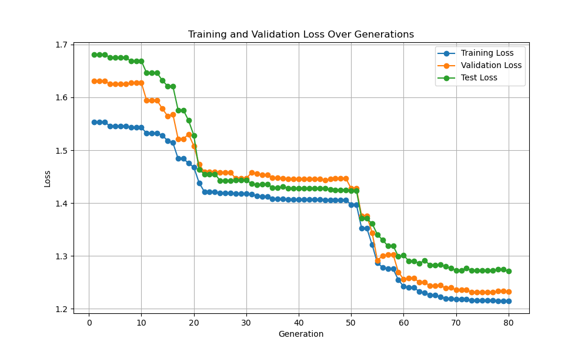

- **Performance:** This model achieves the best results with **Test Accuracy = 0.7716** and **F1-Score = 0.7138**, significantly outperforming the other models.  
- **Explanation of Performance:**  
  - **The three loss curves (Training, Validation, Test) are close to each other** across generations, indicating that the model has learned the **general patterns** of the data.  
  - **Reason:** The 3D CNN has a strong ability to learn **abstract and multi-dimensional features** from the data, which helps balance the distribution of the train, validation, and test sets. This shows that the model not only memorizes the training data but also **understands the underlying structure** of the features, leading to excellent generalization.  
  - **Key Point:** The three curves (Training, Validation, Test) are close because the distributions of the three sets (train, val, test) have been brought closer together. This is due to the 3D CNN's ability to learn abstract information effectively, allowing it to understand the **generalizability** of the dataset.

#### 2. **3D_CNN_init Model**
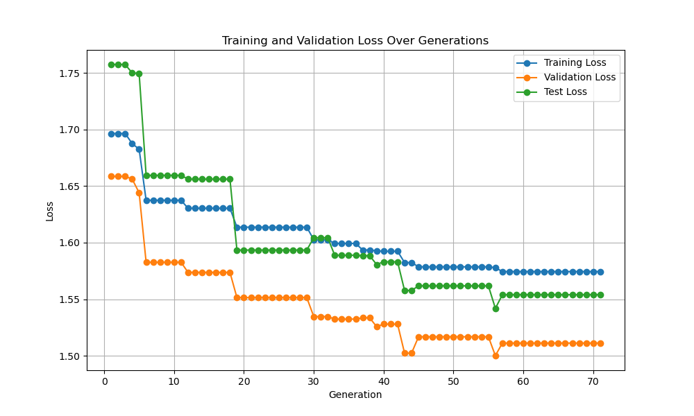

- **Performance:** Test Accuracy = 0.5017, F1-Score = 0.3788.  
- **Weaknesses:**  
  - Despite being a 3D model, the lack of pretraining limits its potential, resulting in significantly lower performance compared to the pretrained version.  

#### 3. **2D_CNN_pretrained Model**
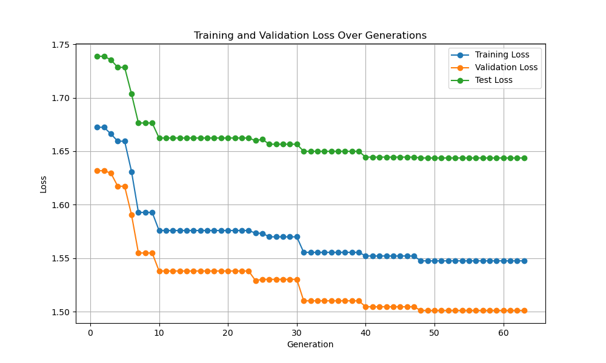

- **Performance:** Test Accuracy = 0.3999, F1-Score = 0.2706.  
- **Reasons:**  
  - **Large gap between loss curves** suggests that the model may not be learning effectively, and further training should be implemented.

#### 4. **2D_CNN_init Model**
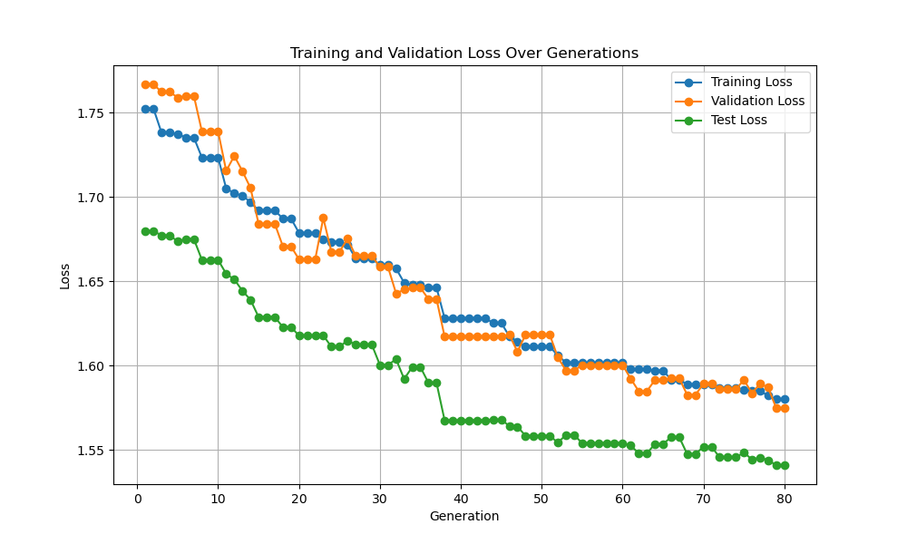

- **Performance:** Despite a Test Accuracy of 0.5025 (higher than 2D pretrained), the F1-Score = 0.3505 is still very low.  
- **Reason:** The extremely low Precision (0.2697) suggests the model predicts many **false positives**, likely due to suboptimal initialization.  

#### 5. **Flatten Model**
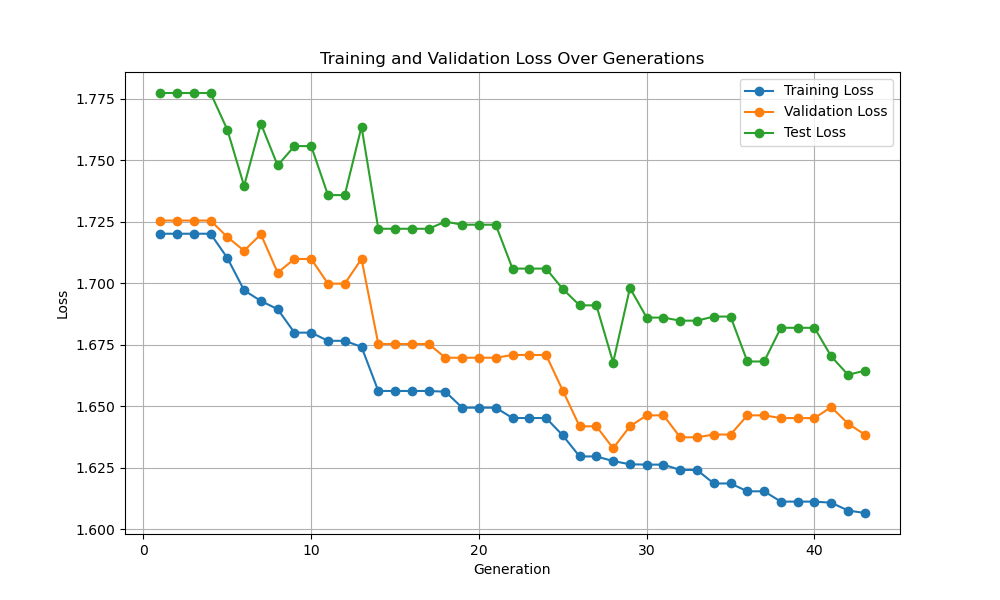

- **Worst Performance:** Test Accuracy = 0.3758, F1-Score = 0.3060.  
- **Reasons:**  
  - The simple architecture (Flatten + MLP) cannot extract meaningful features from complex data.  
  - The loss curves do not decrease significantly across generations, indicating that the model **fails to learn** the relationships in the data.  

#### **Summary of the performance**
| Model                | Embedding Dim | Test Accuracy | Precision | Recall | F1-Score |
|----------------------|---------------|---------------|-----------|--------|----------|
| flatten             | 21952         | 0.3758        | 0.3830    | 0.3758 | 0.3060   |
| 2D_CNN_init         | 1024          | 0.5025        | 0.2697    | 0.5025 | 0.3505   |
| 2D_CNN_pretrained   | 1024          | 0.3999        | 0.2201    | 0.3999 | 0.2706   |
| 3D_CNN_init         | 11776         | 0.5017        | 0.3180    | 0.5017 | 0.3788   |
| 3D_CNN_pretrained   | 11776         | 0.7716        | 0.6889    | 0.7716 | 0.7138   |

### **Conclusion:**
- **3D_CNN_pretrained** is the best-performing model due to its ability to learn abstract features and balance the data distribution.  
- **Pretraining** plays a crucial role in improving performance, especially for complex architectures like 3D CNN.  
- The **closeness of the three loss curves** in the 3D Pretrained model demonstrates its ability to generalize well, as the distributions of the train, validation, and test sets are brought closer together. This is a result of the 3D CNN's strong capability to learn abstract information, allowing it to understand the **generalizability** of the dataset.  
- The 2D and Flatten models require architectural improvements or enhanced data augmentation to compete with the 3D CNN.

### Extreme Gradient Boost (XG Boost)
**Performance:** With each model, the depth coefficients in the range from 1 to 35 with steps of 1 will be substituted for the performance analysis. As the result, the graph showing the correlation between the depth coefficient and performance will be plotted with the accuracy at each step. In this case of study, the learning rate coefficient () will be use at 0.1, 0.2, 0.3 to obtain the results of each max depths range.

**With eta = 0.1, the result obtain:**

Flatten: 
 
| Max depth | Accuracy | Precision | Recall  | F1 Score |
|---------- |----------|-----------|---------|----------|
| 1         | 0.8933   | 0.9036    | 0.8933  | 0.8927   |
| 2         | 0.9398   | 0.9443    | 0.9398  | 0.9394   |
| 3         | 0.9530   | 0.9565    | 0.9530  | 0.9530   |
| 4         | 0.9785   | 0.9788    | 0.9785  | 0.9785   |

2D_CNN_Init:

| Max depth | Accuracy | Precision | Recall  | F1 Score |
|---------- |----------|-----------|---------|----------|
| 1         | 0.9496   | 0.9496    | 0.9496  | 0.9495   |
| 2         | 0.9692   | 0.9691    | 0.9692  | 0.9691   |
| 3         | 0.9716   | 0.9715    | 0.9716  | 0.9716   |
| 4         | 0.9745   | 0.9745    | 0.9745  | 0.9745   |

2D_CNN_Pretrained:

| Max depth | Accuracy | Precision | Recall  | F1 Score |
|-----------|----------|-----------|---------|----------|
| 1         | 0.8874   | 0.8885    | 0.8874  | 0.8861   |
| 2         | 0.9065   | 0.9067    | 0.9065  | 0.9057   |
| 3         | 0.9168   | 0.9169    | 0.9168  | 0.9161   |
| 4         | 0.9158   | 0.9161    | 0.9158  | 0.9149   |

3D_CNN_Init:

| Max depth | Accuracy | Precision | Recall  | F1 Score |
|-----------|----------|-----------|---------|----------|
| 1         | 0.9604   | 0.9605    | 0.9604  | 0.9603   |
| 2         | 0.9745   | 0.9746    | 0.9745  | 0.9745   |
| 3         | 0.9804   | 0.9805    | 0.9804  | 0.9804   |
| 4         | 0.9834   | 0.9834    | 0.9834  | 0.9833   |

3D_CNN_Pretrained:

| Max depth | Accuracy | Precision | Recall  | F1 Score |
|-----------|----------|-----------|---------|----------|
| 1         | 0.9946   | 0.9946    | 0.9946  | 0.9946   |
| 2         | 0.9961   | 0.9961    | 0.9961  | 0.9961   |
| 3         | 0.9951   | 0.9951    | 0.9951  | 0.9951   |
| 4         | 0.9951   | 0.9951    | 0.9951  | 0.9951   |

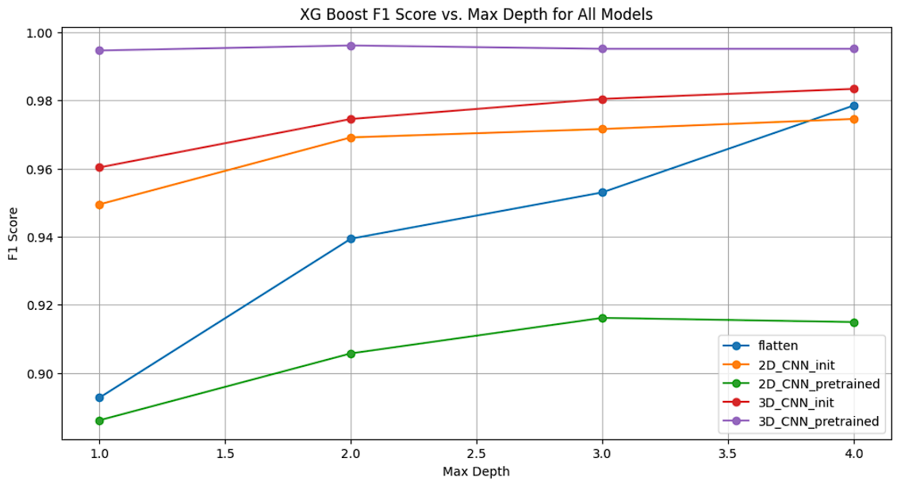

**Analysis:** 

Performance: The 3D_CNN_pretrained model consistently achieves the highest F1 scores at all depths, staying very close to 0.99, with minimal fluctuation. This confirms that pretrained 3D CNN features are highly discriminative and enable superior classification performance, regardless of tree depth. The 3D_CNN_init model performs slightly lower but still strong, steadily improving from 0.961 to 0.983, showing the benefit of 3D feature representations even without pretraining.

The 2D_CNN_init model follows closely, improving with depth from 0.950 to 0.975, showing robust performance and strong feature extraction despite being less expressive than 3D CNNs. In contrast, the 2D_CNN_pretrained model consistently underperforms, peaking around 0.917, and even showing a slight dip at depth 4. This again suggests that the pretrained 2D features may not be well-aligned with the task-specific domain or could be overfitting early.

The flatten model starts at a modest 0.89 but improves significantly, reaching 0.979 by depth 4. This demonstrates how deeper trees help extract useful patterns even from simple or unstructured embeddings, nearly matching more complex models at higher depths.

Storage: Deeper trees in XGBoost, as with Random Forests, increase the number of nodes and parameters to store, especially for high-dimensional CNN-based features. The 3D_CNN_pretrained model, while the most accurate, likely results in the highest storage demand due to both model complexity and deep tree structures.

Speed: Training time and inference latency increase with depth. Deeper XGBoost trees require more computations during both the learning and prediction phases. This is particularly critical for the 3D CNN models, where feature dimensionality is high, increasing the number of comparisons per split. 


**With eta = 0.2, the result obtain:**

Flatten:

| Max depth | Accuracy | Precision | Recall  | F1 Score |
|---------- |----------|-----------|---------|----------|
| 1         | 0.9202   | 0.9262    | 0.9202  | 0.9197   |
| 2         | 0.9550   | 0.9581    | 0.9550  | 0.9549   |
| 3         | 0.9834   | 0.9836    | 0.9834  | 0.9834   |
| 4         | 0.9843   | 0.9845    | 0.9843  | 0.9843   |

2D_CNN_Init:

| Max depth | Accuracy | Precision | Recall  | F1 Score |
|-----------|----------|-----------|---------|----------|
| 1         | 0.9628   | 0.9628    | 0.9628  | 0.9627   |
| 2         | 0.9760   | 0.9760    | 0.9760  | 0.9760   |
| 3         | 0.9750   | 0.9751    | 0.9750  | 0.9750   |
| 4         | 0.9775   | 0.9775    | 0.9775  | 0.9775   |

2D_CNN_Pretrained:

| Max depth | Accuracy | Precision | Recall  | F1 Score |
|-----------|----------|-----------|---------|----------|
| 1         | 0.9026   | 0.9029    | 0.9026  | 0.9017   |
| 2         | 0.9143   | 0.9146    | 0.9143  | 0.9137   |
| 3         | 0.9192   | 0.9192    | 0.9192  | 0.9187   |
| 4         | 0.9173   | 0.9171    | 0.9173  | 0.9164   |

3D_CNN_Init:

| Max depth | Accuracy | Precision | Recall  | F1 Score |
|-----------|----------|-----------|---------|----------|
| 1         | 0.9770   | 0.9770    | 0.9770  | 0.9770   |
| 2         | 0.9834   | 0.9834    | 0.9834  | 0.9833   |
| 3         | 0.9834   | 0.9834    | 0.9834  | 0.9833   |
| 4         | 0.9834   | 0.9834    | 0.9834  | 0.9833   |

3D_CNN_Pretrained:

| Max depth | Accuracy | Precision | Recall  | F1 Score |
|-----------|----------|-----------|---------|----------|
| 1         | 0.9951   | 0.9951    | 0.9951  | 0.9951   |
| 2         | 0.9966   | 0.9966    | 0.9966  | 0.9966   |
| 3         | 0.9946   | 0.9946    | 0.9946  | 0.9946   |
| 4         | 0.9961   | 0.9961    | 0.9961  | 0.9961   |

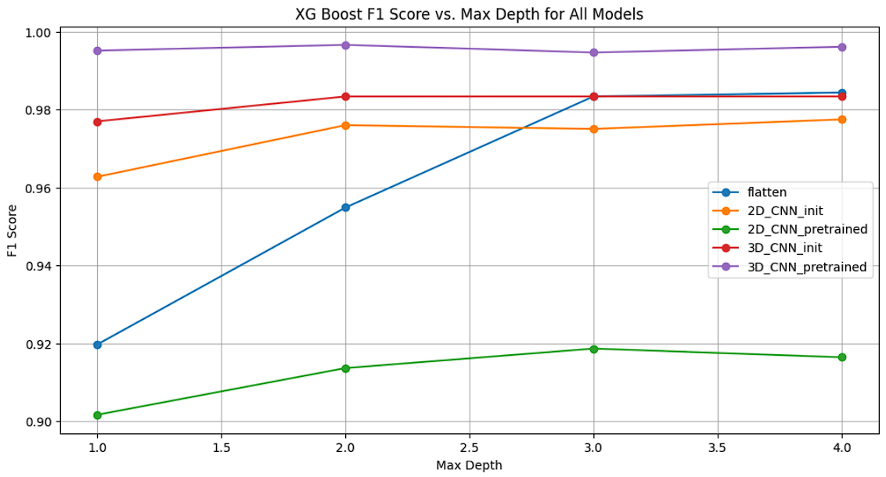

**Analysis:** 

Performance: The 3D_CNN_pretrained model maintains the highest performance across all depths, with F1 scores hovering around 0.995, showing minimal fluctuation. This reaffirms that pretrained 3D CNN features are highly expressive and provide consistently accurate classification, regardless of tree depth.

The 3D_CNN_init model also performs well, starting at 0.977 and slightly increasing to 0.983 by depth 2, then plateauing. This indicates that while the model benefits from deeper trees early on, most of the learning potential is already captured at lower depths due to the strength of 3D features.

The flatten model shows significant improvement with increasing depth, rising from 0.92 to 0.983, matching the 3D_CNN_init model by depth 4. This shows how simple, unstructured features can benefit greatly from deeper decision trees, compensating for the lack of sophisticated feature extraction.

The 2D_CNN_init model improves steadily from 0.963 to 0.978, showing that even without pretraining, 2D CNNs can perform well. However, the 2D_CNN_pretrained model remains the lowest-performing across all depths, peaking at 0.919 and slightly declining afterward, possibly due to mismatched feature transfer or early overfitting.

Storage: As before, deeper trees increase the number of nodes and thus memory requirements. This is particularly critical for models like 3D_CNN_pretrained, which start with high-dimensional features. Models like flatten and 2D_CNN_init may be more memory-efficient in practice due to simpler or lower-dimensional inputs, especially at shallower depths.

Speed: Speed decreases as depth increases due to more calculations during both training and inference. For large datasets or time-sensitive applications, models like 3D_CNN_pretrained may be computationally expensive.

**With eta = 0.3, the result obtain:**

Flatten:

| Max depth | Accuracy | Precision | Recall  | F1 Score |
|-----------|----------|-----------|---------|----------|
| 1         | 0.9305   | 0.9357    | 0.9305  | 0.9301   |
| 2         | 0.9770   | 0.9774    | 0.9770  | 0.9770   |
| 3         | 0.9824   | 0.9826    | 0.9824  | 0.9824   |
| 4         | 0.9853   | 0.9855    | 0.9853  | 0.9853   |

2D_CNN_Init:

| Max depth | Accuracy | Precision | Recall  | F1 Score |
|-----------|----------|-----------|---------|----------|
| 1         | 0.9711   | 0.9711    | 0.9711  | 0.9711   |
| 2         | 0.9780   | 0.9780    | 0.9780  | 0.9779   |
| 3         | 0.9780   | 0.9780    | 0.9780  | 0.9780   |
| 4         | 0.9799   | 0.9799    | 0.9799  | 0.9799   |

2D_CNN_Pretrained:

| Max depth | Accuracy | Precision | Recall  | F1 Score |
|-----------|----------|-----------|---------|----------|
| 1         | 0.9070   | 0.9072    | 0.9070  | 0.9062   |
| 2         | 0.9192   | 0.9194    | 0.9192  | 0.9186   |
| 3         | 0.9192   | 0.9191    | 0.9192  | 0.9187   |
| 4         | 0.9212   | 0.9212    | 0.9212  | 0.9206   |

3D_CNN_Init:

| Max depth | Accuracy | Precision | Recall  | F1 Score |
|-----------|----------|-----------|---------|----------|
| 1         | 0.9790   | 0.9789    | 0.9790  | 0.9789   |
| 2         | 0.9838   | 0.9838    | 0.9838  | 0.9838   |
| 3         | 0.9863   | 0.9863    | 0.9863  | 0.9863   |
| 4         | 0.9868   | 0.9868    | 0.9868  | 0.9868   |

3D_CNN_Pretrained:

| Max depth | Accuracy | Precision | Recall  | F1 Score |
|-----------|----------|-----------|---------|----------|
| 1         | 0.9956   | 0.9956    | 0.9956  | 0.9956   |
| 2         | 0.9966   | 0.9966    | 0.9966  | 0.9966   |
| 3         | 0.9951   | 0.9951    | 0.9951  | 0.9951   |
| 4         | 0.9946   | 0.9946    | 0.9946  | 0.9946   |

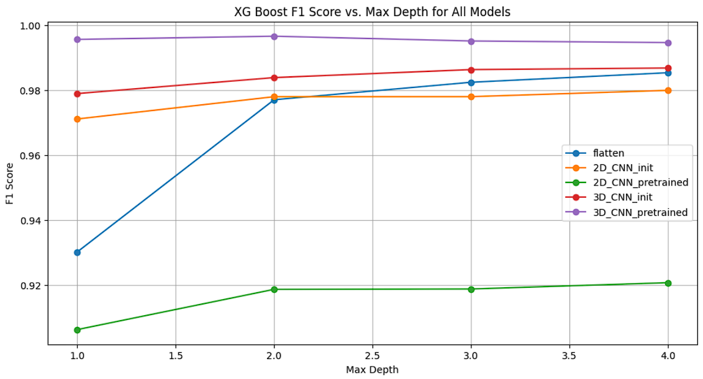

**Analysis:** 

Performance: In terms of performance, the 3D_CNN_pretrained model consistently achieves the highest F1 scores, maintaining near-perfect accuracy (~0.995) across all tested max depths. Its pretrained features likely provide robust, generalizable representations that excel when paired with XGBoost. The 3D_CNN_init model also performs very well, slightly trailing the pretrained version but still maintaining F1 scores above 0.985 at deeper depths. Interestingly, the flatten model shows a steep upward trend, starting around 0.93 and reaching nearly 0.985 at max depth 4, matching the performance of the more complex 3D_CNN_init model. This suggests that, with sufficient tree depth, even simpler features can perform competitively. Meanwhile, 2D_CNN_init shows steady but modest improvements, peaking at around 0.980. The weakest performer is 2D_CNN_pretrained, which, despite the use of pretrained features, levels off below 0.92, indicating that its feature representations are less effective for this task.

Storage: Storage efficiency varies significantly among these models. The flatten model is by far the most compact, as it doesn’t involve any convolutional layers—just raw features directly fed into XGBoost—making it ideal for storage-constrained environments. The 2D_CNN_init and 2D_CNN_pretrained models require moderate storage; while 2D convolutions increase model size compared to flattening, they are far less storage-intensive than their 3D counterparts. Among the most demanding are the 3D_CNN_init and 3D_CNN_pretrained models, both of which include high-dimensional convolution operations. The pretrained version is especially storage-heavy due to the added burden of storing and loading the pretrained weights, which typically come from large-scale training on external datasets.

Speed: The flatten model is the fastest both during feature extraction and inference, owing to its simplicity—no convolutional layers or deep computations are involved. The 2D_CNN_init model is also relatively fast, benefiting from a lightweight 2D architecture. The 2D_CNN_pretrained model may be slightly slower than its initialized counterpart because it often includes additional layers or requires more preprocessing tied to the pretrained weights. On the other hand, 3D_CNN_init introduces a significant speed cost due to the computational load of 3D convolutions, which process spatial and temporal dimensions simultaneously. The slowest model is 3D_CNN_pretrained, which combines the 3D computational burden with additional time required to load and apply pretrained parameters. 

### Adaptive Boost (Ada Boost)
**Performance:** In this study, AdaBoost is utilized with weak learners, where decision tree depths (max_depth) range from 1 to 5 with a step of 1. For performance evaluation, the number of estimators (n_estimators) is varied across 15, 30, and 50. The goal is to analyze the influence of both weak learner complexity and the number of boosting iterations on classification performance. A series of graphs will be generated to illustrate the relationship between each max_depth and the corresponding performance metrics—Accuracy, Precision, Recall, and F1 Score—under each n_estimators setting.

**With n_estimator = 15, the result obtain:**

Flatten: 

| Max depth | Accuracy | Precision | Recall | F1 Score |
|-----------|----------|-----------|--------|----------|
| 1         | 0.5184   | 0.5749    | 0.5184 | 0.4548   |
| 2         | 0.7930   | 0.8036    | 0.7930 | 0.7918   |
| 3         | 0.8350   | 0.8383    | 0.8350 | 0.8346   |
| 4         | 0.8791   | 0.8836    | 0.8791 | 0.8790   |

2D_CNN_Init:

| Max depth | Accuracy | Precision | Recall | F1 Score |
|-----------|----------|-----------|--------|----------|
| 1         | 0.5497   | 0.5025    | 0.5497 | 0.4751   |
| 2         | 0.8164   | 0.8305    | 0.8164 | 0.8150   |
| 3         | 0.9104   | 0.9122    | 0.9104 | 0.9106   |
| 4         | 0.9295   | 0.9301    | 0.9295 | 0.9297   |

2D_CNN_Pretrained:

| Max depth | Accuracy | Precision | Recall | F1 Score |
|-----------|----------|-----------|--------|----------|
| 1         | 0.4072   | 0.4532    | 0.4072 | 0.3106   |
| 2         | 0.8439   | 0.8448    | 0.8439 | 0.8378   |
| 3         | 0.8434   | 0.8433    | 0.8434 | 0.8405   |
| 4         | 0.8311   | 0.8359    | 0.8311 | 0.8310   |

3D_CNN_Init:

| Max depth | Accuracy | Precision | Recall | F1 Score |
|-----------|----------|-----------|--------|----------|
| 1         | 0.6853   | 0.7775    | 0.6853 | 0.6380   |
| 2         | 0.8997   | 0.9002    | 0.8997 | 0.8998   |
| 3         | 0.9305   | 0.9319    | 0.9305 | 0.9304   |
| 4         | 0.9613   | 0.9613    | 0.9613 | 0.9612   |

3D_CNN_Pretrained:

| Max depth | Accuracy | Precision | Recall | F1 Score |
|-----------|----------|-----------|--------|----------|
| 1         | 0.1723   | 0.0489    | 0.1723 | 0.0762   |
| 2         | 0.9775   | 0.9781    | 0.9775 | 0.9775   |
| 3         | 0.9941   | 0.9942    | 0.9941 | 0.9941   |
| 4         | 0.9971   | 0.9971    | 0.9971 | 0.9971   |

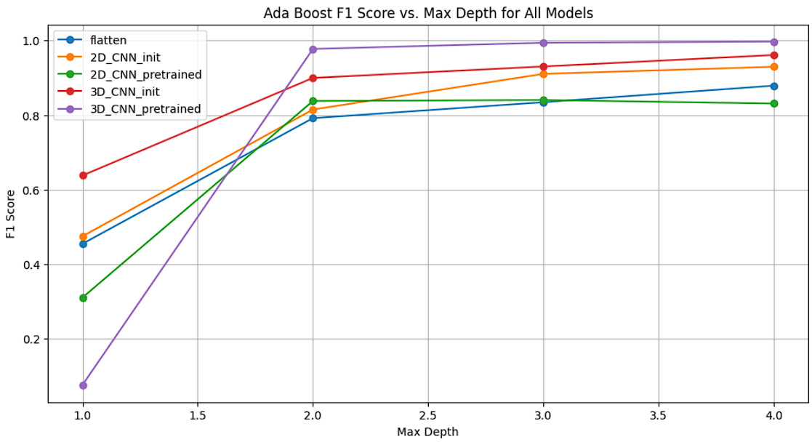

**Analysis:** 

Performance: Under AdaBoost, the 3D_CNN_pretrained model again emerges as the top performer, reaching near-perfect F1 scores (~0.995–0.998) from max depth 2 onward. Interestingly, this model shows a dramatic leap in performance between depths 1 and 2, indicating strong non-linear feature utility when boosted trees are allowed greater depth. 3D_CNN_init also performs robustly, increasing steadily with depth and peaking just under 0.95. The 2D_CNN_init model performs better than 2D_CNN_pretrained, climbing up to about 0.92, while the pretrained 2D variant lags slightly and even shows a minor decline at depth 4. The flatten model starts low at around 0.46 and steadily climbs to nearly 0.88 by depth 4, reflecting its dependency on tree depth to extract complex decision boundaries. Overall, 3D features—especially pretrained—are the most powerful when paired with AdaBoost, while pretrained 2D features seem less well-aligned with the boosting framework.

Storage: The flatten model remains the most lightweight due to its use of raw features without convolutional encodings. 2D_CNN_init and 2D_CNN_pretrained sit in the middle, requiring moderate storage to accommodate convolutional filters, though the pretrained model includes extra parameters from external training. The 3D_CNN_init model demands more space due to the complexity of 3D convolutional layers, and the 3D_CNN_pretrained model is the most storage-heavy, carrying both volumetric operations and large pretrained weight files. The tradeoff between model storage and performance is clearly visible—models with higher storage costs tend to yield superior AdaBoost F1 performance.

Speed: The flatten model is the fastest, thanks to its minimal preprocessing and absence of deep learning overhead. The 2D_CNN_init model is relatively fast too, while 2D_CNN_pretrained may suffer from marginally increased latency due to extra loading and preprocessing steps. The 3D_CNN_init model is significantly slower, requiring substantial computation for spatiotemporal feature extraction. The 3D_CNN_pretrained model is the slowest, combining both the computation-heavy 3D architecture and the overhead of loading and applying pretrained weights. 

**With n_estimator = 30, the result obtain:**

Flatten: 

| Max depth | Accuracy | Precision | Recall | F1 Score |
|-----------|----------|-----------|--------|----------|
| 1         | 0.6016   | 0.6541    | 0.6016 | 0.5633   |
| 2         | 0.8253   | 0.8391    | 0.8253 | 0.8234   |
| 3         | 0.8786   | 0.8828    | 0.8786 | 0.8788   |
| 4         | 0.9236   | 0.9245    | 0.9236 | 0.9238   |

2D_CNN_Init:

| Max depth | Accuracy | Precision | Recall | F1 Score |
|-----------|----------|-----------|--------|----------|
| 1         | 0.5453   | 0.6020    | 0.5453 | 0.4895   |
| 2         | 0.8375   | 0.8421    | 0.8375 | 0.8365   |
| 3         | 0.9256   | 0.9273    | 0.9256 | 0.9259   |
| 4         | 0.9491   | 0.9495    | 0.9491 | 0.9492   |

2D_CNN_Pretrained:

| Max depth | Accuracy | Precision | Recall | F1 Score |
|-----------|----------|-----------|--------|----------|
| 1         | 0.5634   | 0.4417    | 0.5634 | 0.4739   |
| 2         | 0.8512   | 0.8528    | 0.8512 | 0.8503   |
| 3         | 0.8502   | 0.8497    | 0.8502 | 0.8479   |
| 4         | 0.8708   | 0.8707    | 0.8708 | 0.8697   |

3D_CNN_Init:

| Max depth | Accuracy | Precision | Recall | F1 Score |
|-----------|----------|-----------|--------|----------|
| 1         | 0.7225   | 0.6783    | 0.7225 | 0.6785   |
| 2         | 0.8884   | 0.8968    | 0.8884 | 0.8865   |
| 3         | 0.9579   | 0.9580    | 0.9579 | 0.9579   |
| 4         | 0.9604   | 0.9604    | 0.9604 | 0.9603   |

3D_CNN_Pretrained:

| Max depth | Accuracy | Precision | Recall | F1 Score |
|-----------|----------|-----------|--------|----------|
| 1         | 0.5135   | 0.3850    | 0.5135 | 0.4129   |
| 2         | 0.9912   | 0.9913    | 0.9912 | 0.9912   |
| 3         | 0.9961   | 0.9961    | 0.9961 | 0.9961   |
| 4         | 0.9971   | 0.9971    | 0.9971 | 0.9971   |

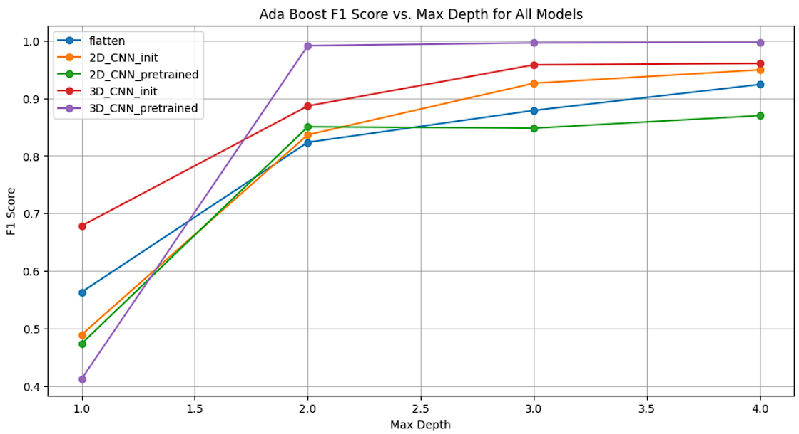

**Analysis:** 

Performance: The 3D_CNN_pretrained model once again dominates in terms of F1 score, achieving nearly perfect classification performance (F1 ≈ 1.0) starting at depth 2 and maintaining that plateau throughout. This sharp rise suggests highly transferable features that pair well with AdaBoost when the model complexity is moderately increased. The 3D_CNN_init model trails closely, improving consistently with depth and stabilizing around 0.95. 2D_CNN_init and 2D_CNN_pretrained both demonstrate solid improvements, with the initialized version slightly outperforming its pretrained counterpart—reaching 0.94 vs. 0.87 respectively. The flatten model shows linear growth across depths, starting at ~0.56 and peaking just above 0.92, reflecting the benefit of allowing greater decision boundaries in AdaBoost when using raw features.

Storage: The flatten model remains the most efficient, requiring minimal memory since it lacks convolutional encoders. The 2D_CNN_init and 2D_CNN_pretrained models are moderate in size, with the pretrained variant slightly heavier due to stored weights. 3D_CNN_init significantly increases storage costs due to complex spatiotemporal convolutional layers, and 3D_CNN_pretrained is the largest, combining the depth of 3D architecture with external learned weights. As in previous analyses, there is a clear trade-off between storage and performance: models with higher memory footprints, especially those using pretrained 3D features, achieve superior F1 scores with boosting.

Speed: The flatten model is the most computationally efficient, offering faster inference and training due to its lack of deep processing layers. The 2D_CNN_init model is also relatively fast, while 2D_CNN_pretrained may introduce minor overhead from loading pretrained weights. The 3D_CNN_init model adds considerable latency due to volumetric data handling and dense convolution operations. 3D_CNN_pretrained, being the most resource-intensive, incurs the highest latency in both loading and forward pass times.

**With n_estimator = 50, the result obtain:**

Flatten: 

| Max depth | Accuracy | Precision | Recall | F1 Score |
|-----------|----------|-----------|--------|----------|
| 1         | 0.5884   | 0.6174    | 0.5884 | 0.5327   |
| 2         | 0.8473   | 0.8529    | 0.8473 | 0.8469   |
| 3         | 0.8957   | 0.8979    | 0.8957 | 0.8957   |
| 4         | 0.9300   | 0.9308    | 0.9300 | 0.9302   |

2D_CNN_Init:

| Max depth | Accuracy | Precision | Recall | F1 Score |
|-----------|----------|-----------|--------|----------|
| 1         | 0.5751   | 0.5948    | 0.5751 | 0.5046   |
| 2         | 0.8654   | 0.8732    | 0.8654 | 0.8640   |
| 3         | 0.9290   | 0.9306    | 0.9290 | 0.9290   |
| 4         | 0.9574   | 0.9576    | 0.9574 | 0.9574   |

2D_CNN_Pretrained:

| Max depth | Accuracy | Precision | Recall | F1 Score |
|-----------|----------|-----------|--------|----------|
| 1         | 0.6711   | 0.6148    | 0.6711 | 0.6283   |
| 2         | 0.8404   | 0.8429    | 0.8404 | 0.8339   |
| 3         | 0.8639   | 0.8653    | 0.8639 | 0.8643   |
| 4         | 0.8634   | 0.8653    | 0.8634 | 0.8631   |

3D_CNN_Init:

| Max depth | Accuracy | Precision | Recall | F1 Score |
|-----------|----------|-----------|--------|----------|
| 1         | 0.7391   | 0.7264    | 0.7391 | 0.6992   |
| 2         | 0.9197   | 0.9204    | 0.9197 | 0.9195   |
| 3         | 0.9638   | 0.9643    | 0.9638 | 0.9638   |
| 4         | 0.9706   | 0.9707    | 0.9706 | 0.9706   |

3D_CNN_Pretrained:

| Max depth | Accuracy | Precision | Recall | F1 Score |
|-----------|----------|-----------|--------|----------|
| 1         | 0.8160   | 0.7426    | 0.8160 | 0.7646   |
| 2         | 0.9936   | 0.9936    | 0.9936 | 0.9936   |
| 3         | 0.9976   | 0.9976    | 0.9976 | 0.9976   |
| 4         | 0.9966   | 0.9966    | 0.9966 | 0.9966   |

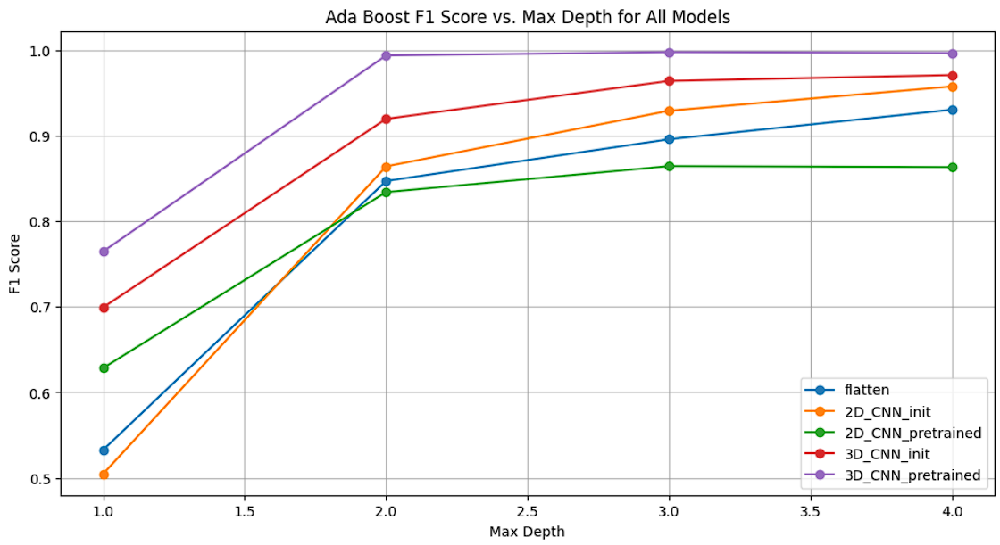

**Analysis:** 

Performance: 3D_CNN_pretrained continues to outperform all other models, achieving near-perfect F1 scores (approaching 1.0) as early as depth 2 and maintaining this across increasing depths. The 3D_CNN_init model also delivers robust performance, reaching an F1 score above 0.95 by depth 3. The 2D_CNN_init model demonstrates solid gains, starting from 0.51 and peaking at 0.95, closely aligning with flatten, which steadily improves from 0.53 to 0.93. 2D_CNN_pretrained, while showing initial strength (starting around 0.63), plateaus earlier and finishes with the lowest F1 score among CNN-based approaches (~0.87), possibly indicating less synergy between its features and the AdaBoost classifier. Overall, pretrained 3D features offer the best consistency and top-tier performance in this boosting setup.

Storage: The flatten model remains the most storage-efficient, using minimal memory by forgoing deep feature encoders. The 2D_CNN_init and 2D_CNN_pretrained models require moderate storage, with the pretrained version storing additional weights. The 3D_CNN_init model incurs higher memory demands due to its more complex convolutional structure, while 3D_CNN_pretrained is the most memory-intensive due to both architectural depth and loaded weights. This increase in storage correlates with improved performance, especially for pretrained 3D models, emphasizing the storage-performance trade-off inherent in deep learning pipelines.

Speed: The flatten model is the fastest, both in training and inference, due to the absence of convolutional layers. 2D_CNN_init offers decent speed, while 2D_CNN_pretrained might slightly slow down due to weight loading and fine-tuned layer structure. 3D_CNN_init and 3D_CNN_pretrained are the slowest due to the volumetric nature of 3D data and the depth of their convolutional layers, with pretrained models adding loading and initialization overhead.


### Feature Selection with GridSearch

Random Forest with Gridsearch using TSNE Embedding

| Model                | Test Accuracy | Precision | Recall | F1-Score |
|----------------------|---------------|-----------|--------|----------|
| flatten             |0.9075         | 0.9084    | 0.9075 | 0.9076   |
| 2D_CNN_init         |0.9750         | 0.9751    | 0.9750 | 0.9750   |
| 2D_CNN_pretrained   |0.8688         | 0.8718    | 0.8688 | 0.8671   |
| 3D_CNN_init         |0.9618         | 0.9627    | 0.9618 | 0.9618   |
| 3D_CNN_pretrained   |0.9956         | 0.9956    | 0.9956 | 0.9956   |

## References
<a id="1">[1]</a> 
```
@article{yang2023medmnist,
  title={Medmnist v2-a large-scale lightweight benchmark for 2d and 3d biomedical image classification},
  author={Yang, Jiancheng and Shi, Rui and Wei, Donglai and Liu, Zequan and Zhao, Lin and Ke, Bilian and Pfister, Hanspeter and Ni, Bingbing},
  journal={Scientific Data},
  volume={10},
  number={1},
  pages={41},
  year={2023},
  publisher={Nature Publishing Group UK London}
}
```
