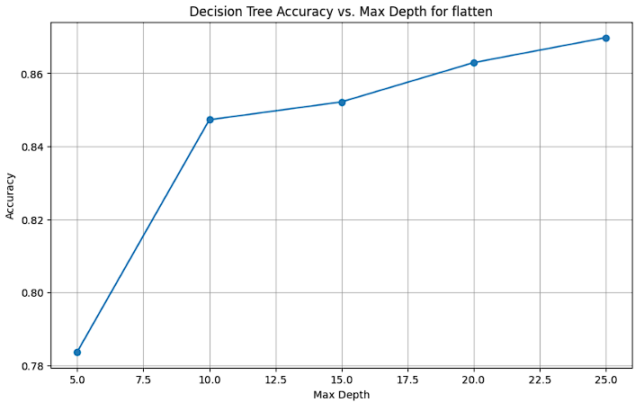
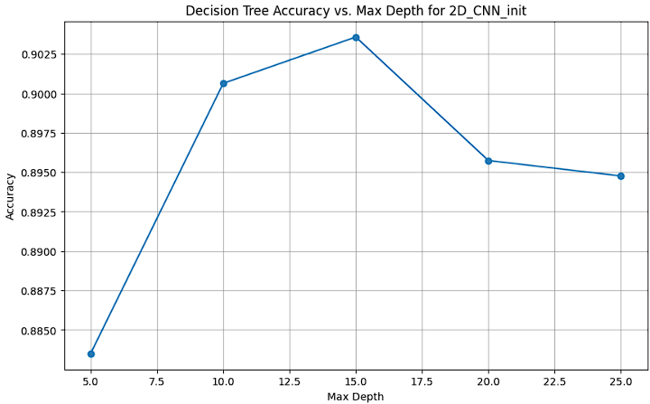
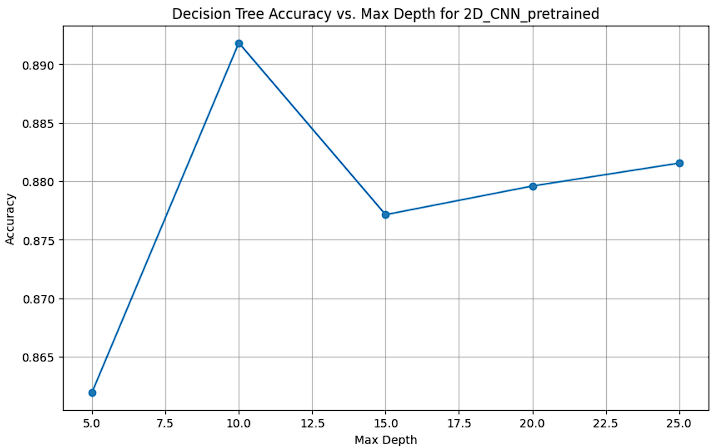
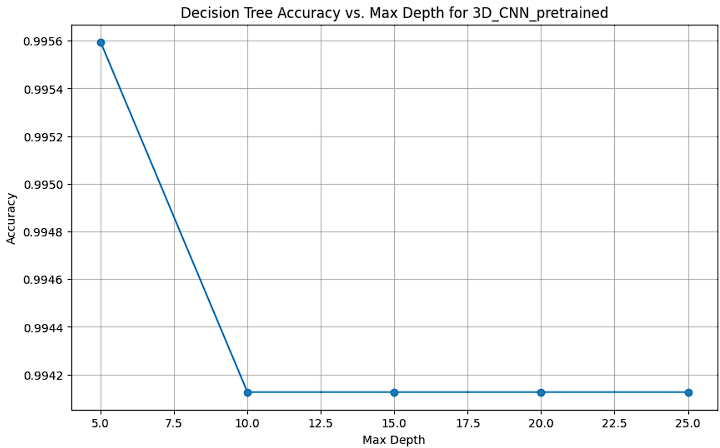

<!-- PAPER TITLE -->

# Machine Learning Assignment 1

<!-- TABLE OF CONTENTS -->

<details>
  <summary>Table of Contents</summary>
  <ol>
    <li><a href="#authors">Authors</a></li>
    <li><a href="#enviroments">Enviroments</a></li>
    <li><a href="#introduction">Introduction</a></li>
    <li><a href="#datasets">Datasets</a></li>
    <li><a href="#embedding-method">Embedding method</a></li>
    <li><a href="#references">References</a></li>
  </ol>
</details>

## Authors

<ol>
    <li><a href="">Tieu Tri Bang       - 2252079</a></li>
    <li><a href="">Nguyen Van Hieu     - 2153345</a></li>
    <li><a href="">Pham Huy Thien Phuc - 2053346</a></li>
</ol>

## Enviroments
All experiments run successfully on Google Colab with:
Python version: 3.11.11
PyTorch version: 2.5.1+cu124

## Introduction
The classification of 3D medical images presents unique challenges and opportunities in the field of medical imaging and machine learning. In this study, we leverage the MedMNIST dataset, a standardized benchmark for medical imaging tasks, to develop and evaluate classifiers for 3D image data. We explore three distinct embedding approaches: a flatten-based method, a 2D Convolutional Neural Network (CNN), and a 3D CNN, each designed to capture spatial features at varying levels of complexity. Results demonstrate that the 3D CNN outperforms simpler embeddings in capturing intricate volumetric patterns, though trade-offs in computational cost are notable. This work provides insights into the suitability of these approaches for 3D medical image classification and establishes a foundation for future advancements in automated diagnostic systems.
## Datasets


In this study, we utilize six 3D datasets from MedMNIST—OrganMNIST3D, NoduleMNIST3D, AdrenalMNIST3D, FractureMNIST3D, VesselMNIST3D, and SynapseMNIST3D—each preprocessed to a standardized 28x28x28 resolution, to investigate multi-class classification of anatomical and pathological features.


## Embedding 
### Method


**Flatten**: In this method, each 3D volume is unraveled into a 1D vector of length 21,952 (28 × 28 × 28). While computationally simple and requiring minimal architectural complexity, this approach discards all spatial relationships inherent in the volumetric data, treating each voxel as an independent feature. As a result, it relies entirely on the subsequent dense layers to learn any patterns or dependencies, making it less suited for capturing the rich 3D structural information present in medical imaging tasks.


**2D-CNN**: The 2D-CNN embedding adapts a conventional 2D convolutional approach to handle the 3D 28x28x28 volumes by treating the depth dimension as a channel-like feature. Specifically, each 3D volume is processed as a stack of 28 two-dimensional 28x28 slices, where the depth (z-axis) is interpreted as 28 input channels. A 2D-CNN architecture, consisting of convolutional layers, pooling layers, and fully connected layers, is then applied to extract spatial features from each slice. This method leverages well-established 2D convolutional operations to capture patterns within individual planes of the volume, such as edges or textures, but it does not explicitly model correlations across the depth dimension. While more sophisticated than the flatten approach, the 2D-CNN may struggle to fully represent the volumetric relationships critical for 3D medical image classification, potentially limiting its performance on tasks requiring holistic 3D understanding.


**3D-CNN**: The 3D-CNN embedding is designed to fully exploit the volumetric nature of the 28x28x28 MedMNIST datasets by applying 3D convolutional operations. In this approach, the input volume is processed directly as a 3D tensor, with convolutional kernels extending across all three dimensions (x, y, z). The architecture typically includes multiple 3D convolutional layers followed by pooling layers to reduce spatial dimensions, culminating in fully connected layers for classification. This method captures spatial dependencies and contextual information across the entire volume, making it particularly well-suited for identifying complex 3D structures, such as organ boundaries, nodule shapes, or vascular networks. However, the increased representational power comes at the cost of higher computational complexity and memory requirements compared to the flatten and 2D-CNN methods.
### Feature Analysis
#### Flatten:


#### 2D-CNN:
**Initialization weight:**


**Pretrained weight:**


#### 3D-CNN:
**Initialization weight:**


**Pretrained weight:**

### Performance Analysis

### Computational Efficiency Analysis

## Machine Learning Algorithm 
### Decision tree
**Performance:** With each model, the depth coefficients in the range from 5 to 30 with steps of 5 will be substituted for the performance analysis. As the result, the graph showing the correlation between the depth coefficient and performance will be plotted with the accuracy at each step.


 ============= flatten ============== 
 
Max depth: 5
Accuracy: 0.7837

Max depth: 10
Accuracy: 0.8473

Max depth: 15
Accuracy: 0.8522

Max depth: 20
Accuracy: 0.8629

Max depth: 25
Accuracy: 0.8698



 ============= 2D_CNN_init ============== 
 
Max depth: 5
Accuracy: 0.8835

Max depth: 10
Accuracy: 0.9006

Max depth: 15
Accuracy: 0.9036

Max depth: 20
Accuracy: 0.8957

Max depth: 25
Accuracy: 0.8948



 ============= 2D_CNN_pretrained ============== 
 
Max depth: 5
Accuracy: 0.8620

Max depth: 10
Accuracy: 0.8918

Max depth: 15
Accuracy: 0.8771

Max depth: 20
Accuracy: 0.8796

Max depth: 25
Accuracy: 0.8815


 ============= 3D_CNN_init ============== 
 
Max depth: 5
Accuracy: 0.9065

Max depth: 10
Accuracy: 0.9295

Max depth: 15
Accuracy: 0.9261

Max depth: 20
Accuracy: 0.9241

Max depth: 25
Accuracy: 0.9187



 ============= 3D_CNN_pretrained ============== 
 
Max depth: 5
Accuracy: 0.9956

Max depth: 10
Accuracy: 0.9941

Max depth: 15
Accuracy: 0.9941

Max depth: 20
Accuracy: 0.9941

Max depth: 25
Accuracy: 0.9941


**Result analysis:** Increasing max_depth allows the decision tree to become more complex and capture finer details in the data. Initially, this can improve accuracy as the model better fits the training data. However, if max_depth is too large, the model risks overfitting, meaning it memorizes noise and random variations instead of learning general patterns. Overfitting leads to poor generalization, where the model performs well on training data but poorly on unseen test data. Beyond a certain max_depth, performance may start to decrease as the model becomes overly complex, emphasizing specific instances rather than broader trends. The optimal max_depth strikes a balance between fitting the training data and generalizing to new data. 


## References

```

```
